```python
import psycopg2
import math
import pandas
from pandas import *

%matplotlib inline 
import matplotlib.pyplot as plt
import seaborn as sns
import brewer2mpl
```


```python
from notebook.services.config import ConfigManager
cm = ConfigManager()
cm.update('livereveal', {
              'theme': 'solarized',
              'transition': 'default',
              'start_slideshow_at': 'selected',
})
```


    {u'start_slideshow_at': 'selected',
     u'theme': 'solarized',
     u'transition': 'default'}


## Module 0: Background

* ### The dataset: www.airbnb.com
* ### Listing data (excludes reviews and indication of how frequently a listing is rented)
* ### Create a pricing model
 * #### Find over/undervalued properties
 * #### Spot opportunities as a host (renter)
* ### ~35k listings for NYC scraped using some python scripts I wrote
* ### Data is in one HAWQ table called listings

## Tools:

* ### HAWQ
 * #### SQL 
 * #### pgAdmin III
 * #### MADlib
 * #### PL/Python

* ### Python (Anaconda and the PyData Stack)
 * #### Jupyter notebook (with RISE/revealjs)
 * #### pandas (built on numpy)
 * #### seaborn (built on matplotlib)
 * #### scikit-learn (maybe)

### You might:

* #### have little/no experience with SQL

* #### have no experience with python

### That's okay because:

* #### This uses mostly basic features of SQL and python (and pandas)

* #### I will provide you with the data and the notebook so you can try it on your own

* #### There is lots of reusable code in what's to follow

* #### Abstraction!

* #### This is (almost) exactly how I picked up python (and pandas): https://www.youtube.com/watch?v=w26x-z-BdWQ

* #### Some cheatsheets: https://drive.google.com/drive/u/0/folders/0ByIrJAE4KMTtaGhRcXkxNHhmY2M

### The purpose of today: 

* #### Python alleviates some of SQL's pain points
 * #### intentional lack of abstraction (ANSI standard)
 * #### repetitiveness

* #### HAWQ enables python work on big data, easily

* #### demonstrate a repeatable, scalable workflow and framework for doing data science

## Your data starts like this:


```python
from IPython.display import Image
Image('http://www.miningglobal.com/public/uploads/large/large_Diamond_mine._.jpg', width='50%')
```


## HAWQ makes it like this:


```python
Image('https://s-media-cache-ak0.pinimg.com/736x/78/f6/4d/78f64d2b38e4bcf6336a319544bee8d3.jpg', width='30%')
```


## Python+HAWQ makes it like this:


```python
Image('http://www.j-beads.com/blog/wp-content/uploads/2013/06/diamond.jpg', width='30%')
```


## Module 1: Querying HAWQ via Python


```python
conn = psycopg2.connect("""
host=localhost 
port=3005 
dbname=airbnb 
user=gpadmin 
password=gpadmin""") 
cur = conn.cursor()
```


```python
query = 'SELECT COUNT(*) from listings'
cur.execute(query)
cur.fetchone()
```


    (34429L,)


```python
query = """
SELECT *
FROM listings
LIMIT 3"""
cur.execute(query)
print [desc[0] for desc in cur.description]
```

    ['lid', 'access', 'address', 'amenities', 'bathrooms', 'bed_type', 'bed_type_category', 'bedrooms', 'beds', 'calendar_updated_at', 'cancel_policy', 'cancel_policy_short_str', 'cancellation_policy', 'check_in_time', 'check_out_time', 'city', 'cleaning_fee_native', 'description', 'extra_user_info', 'extras_price_native', 'guests_included', 'has_agreed_to_legal_terms', 'has_availability', 'has_double_blind_reviews', 'has_viewed_terms', 'house_rules', 'instant_bookable', 'interaction', 'is_location_exact', 'lat', 'license', 'listing_cleaning_fee_native', 'listing_price_for_extra_person_native', 'listing_security_deposit_native', 'listing_weekend_price_native', 'lng', 'max_nights_input_value', 'min_nights_input_value', 'monthly_price_factor', 'monthly_price_native', 'name', 'neighborhood', 'neighborhood_overview', 'notes', 'person_capacity', 'picture_count', 'price', 'price_for_extra_person_native', 'property_type', 'require_guest_profile_picture', 'review_rating_accuracy', 'review_rating_checkin', 'review_rating_cleanliness', 'review_rating_communication', 'review_rating_location', 'review_rating_value', 'reviews_count', 'room_type', 'room_type_category', 'security_deposit_native', 'security_price_native', 'smart_location', 'space', 'special_offer', 'square_feet', 'star_rating', 'summary', 'transit', 'user_id', 'weekly_price_factor', 'weekly_price_native', 'zipcode']


```python
row = cur.fetchone()
while row:
    print row
    row = cur.fetchone()
    break
```

    (6029332, 'You have access to my room, my personal living room, the kitchen, the dining room, the stereotypical NY fire escape,  and both bathrooms.', 'Judge Street, Brooklyn, NY 11211, United States', 'Internet,Wireless Internet,Air Conditioning,Kitchen,Heating,Smoke Detector,Carbon Monoxide Detector,Essentials', 1.5, 'Real Bed', 'real_bed', 1, 2, '2 months ago', 3, 'Flexible', 'flexible', None, None, 'Brooklyn', None, "Renting my large bedroom in Williamsburg, Brooklyn. The room has it's own living room. The apartment is large and includes 1.5 bathrooms, a full kitchen, and dining room. It is located 2 blocks from the Grand Street L train.\n\nI will be out of town for a week in November so I am renting out my side which includes its own living room and, if you'd like, use of its own entrance. The king-size bed sleeps two and the pull out couch sleeps two as well.\n\nYou have access to my room, my personal living room, the kitchen, the dining room, the stereotypical NY fire escape,  and both bathrooms.\n\nI am happy to give you tips when I'm around. I'm a life long New Yorker, and I'm a pretty good source of info. My roommate is also very friendly. She is a hip fashion designer who has lived in Williamsburg for years.\n\nIt's Williamsburg, literally the hippest place in NYC right now and only 10 minutes from the East Village.\n\nExtremely close to the L train, a subway line (maybe 2 minutes on foot?). Tons of buses too. Also a block from Citibike if you'd like to bike around NYC.  For cabs I would use Lyft or Uber.\n\nMy apartment is ridiculously close to amazing bars, restaurants, and coffee shops, but you can actually get some sleep when you get to the room because our street is rather quiet.", None, None, 2, True, True, None, True, 'Smoking outside. Be mature about whom you bring over.', None, "I am happy to give you tips when I'm around. I'm a life long New Yorker, and I'm a pretty good source of info. My roommate is also very friendly. She is a hip fashion designer who has lived in Williamsburg for years.", True, 40.7119232034, None, None, 30, None, 115, -73.941605295, None, 2, 0.7, '2200', 'Very private & large room Wburg BK', 'Williamsburg', "It's Williamsburg, literally the hippest place in NYC right now and only 10 minutes from the East Village.", 'My apartment is ridiculously close to amazing bars, restaurants, and coffee shops, but you can actually get some sleep when you get to the room because our street is rather quiet.', 3, 15, 110, 30, 'Apartment', None, 10, 10, 10, 10, 10, 10, 4, 'Private room', 'private_room', None, None, 'Brooklyn, NY', "I will be out of town for a week in November so I am renting out my side which includes its own living room and, if you'd like, use of its own entrance. The king-size bed sleeps two and the pull out couch sleeps two as well.", None, None, 5.0, "Renting my large bedroom in Williamsburg, Brooklyn. The room has it's own living room. The apartment is large and includes 1.5 bathrooms, a full kitchen, and dining room. It is located 2 blocks from the Grand Street L train.", "Extremely close to the L train, a subway line (maybe 2 minutes on foot?). Tons of buses too. Also a block from Citibike if you'd like to bike around NYC.  For cabs I would use Lyft or Uber.", 1257611, 0.85, 684, '11211')


## Module 2: using the Python library 'pandas' to
* #### Add functionality
* #### Improve the visual aspect (make tabular)


```python
query = """
SELECT *
FROM listings
LIMIT 5"""
cur.execute(query)
DataFrame(cur.fetchall(), columns = [desc[0] for desc in cur.description])
```


<div>
<table border="1" class="dataframe">
  <thead>
    <tr style="text-align: right;">
      <th></th>
      <th>lid</th>
      <th>access</th>
      <th>address</th>
      <th>amenities</th>
      <th>bathrooms</th>
      <th>bed_type</th>
      <th>bed_type_category</th>
      <th>bedrooms</th>
      <th>beds</th>
      <th>calendar_updated_at</th>
      <th>...</th>
      <th>space</th>
      <th>special_offer</th>
      <th>square_feet</th>
      <th>star_rating</th>
      <th>summary</th>
      <th>transit</th>
      <th>user_id</th>
      <th>weekly_price_factor</th>
      <th>weekly_price_native</th>
      <th>zipcode</th>
    </tr>
  </thead>
  <tbody>
    <tr>
      <th>0</th>
      <td>6029332</td>
      <td>You have access to my room, my personal living...</td>
      <td>Judge Street, Brooklyn, NY 11211, United States</td>
      <td>Internet,Wireless Internet,Air Conditioning,Ki...</td>
      <td>1.5</td>
      <td>Real Bed</td>
      <td>real_bed</td>
      <td>1</td>
      <td>2</td>
      <td>2 months ago</td>
      <td>...</td>
      <td>I will be out of town for a week in November s...</td>
      <td>None</td>
      <td>None</td>
      <td>5</td>
      <td>Renting my large bedroom in Williamsburg, Broo...</td>
      <td>Extremely close to the L train, a subway line ...</td>
      <td>1257611</td>
      <td>0.85</td>
      <td>684</td>
      <td>11211</td>
    </tr>
    <tr>
      <th>1</th>
      <td>4325397</td>
      <td>Trains close by. One stop to midtown Manhattan...</td>
      <td>Crescent Street, Queens, NY 11101, United States</td>
      <td>Internet,Wireless Internet,Air Conditioning,Ki...</td>
      <td>1.0</td>
      <td>Real Bed</td>
      <td>real_bed</td>
      <td>1</td>
      <td>1</td>
      <td>5 days ago</td>
      <td>...</td>
      <td>Private room with lots of light.  Brand New do...</td>
      <td>None</td>
      <td>None</td>
      <td>NaN</td>
      <td>For visitors on the budget with super short co...</td>
      <td>Super convenient many trains.  Q/N or 7 train ...</td>
      <td>22460246</td>
      <td>1.00</td>
      <td>525</td>
      <td>11101</td>
    </tr>
    <tr>
      <th>2</th>
      <td>6422551</td>
      <td>You'll have access to the entire apartment: ba...</td>
      <td>Grattan Street, Brooklyn, NY 11237, United States</td>
      <td>TV,Internet,Wireless Internet,Air Conditioning...</td>
      <td>1.0</td>
      <td>Real Bed</td>
      <td>real_bed</td>
      <td>1</td>
      <td>1</td>
      <td>7 months ago</td>
      <td>...</td>
      <td>This is a cute bedroom with amazing, happy lig...</td>
      <td>None</td>
      <td>None</td>
      <td>NaN</td>
      <td>Cute and clean bedroom with lots of sun and gr...</td>
      <td>We live two minutes from the L train at Morgan...</td>
      <td>9072708</td>
      <td>1.00</td>
      <td>550</td>
      <td>11237</td>
    </tr>
    <tr>
      <th>3</th>
      <td>6684697</td>
      <td>Guests have access to the apartment, the roof,...</td>
      <td>Lorimer Street, Brooklyn, NY 11206, United States</td>
      <td>TV,Cable TV,Internet,Wireless Internet,Air Con...</td>
      <td>1.0</td>
      <td>Real Bed</td>
      <td>real_bed</td>
      <td>1</td>
      <td>1</td>
      <td>5 days ago</td>
      <td>...</td>
      <td>The apartment faces the courtyard of the build...</td>
      <td>None</td>
      <td>None</td>
      <td>5</td>
      <td>A clean and modern apartment with enormous win...</td>
      <td>The apartment is a short walk from the L, J, M...</td>
      <td>315082</td>
      <td>1.00</td>
      <td>NaN</td>
      <td>11206</td>
    </tr>
    <tr>
      <th>4</th>
      <td>4587554</td>
      <td>None</td>
      <td>Jay Ave, Maspeth, NY 11378, United States</td>
      <td>TV,Internet,Wireless Internet,Air Conditioning...</td>
      <td>1.0</td>
      <td>Real Bed</td>
      <td>real_bed</td>
      <td>1</td>
      <td>2</td>
      <td>3 months ago</td>
      <td>...</td>
      <td>None</td>
      <td>None</td>
      <td>None</td>
      <td>5</td>
      <td>Our big 3 bedroom apt has a ton of sunlight th...</td>
      <td>None</td>
      <td>10258940</td>
      <td>0.91</td>
      <td>350</td>
      <td>11378</td>
    </tr>
  </tbody>
</table>
<p>5 rows × 72 columns</p>
</div>


### Code reusability: you can copy-paste this into your own scripts


```python
def query(queries, return_data = True):
    results = []
    if type(queries) is str:
        queries = [queries]
    for q in queries:
        try:
            cur.execute(q)
        except Exception, e:
            print e
            conn.rollback()
            return None
        if return_data == True:
            try:
                results.append(DataFrame(cur.fetchall(), 
                    columns = [desc[0] for desc in cur.description]))
            except:
                pass
    conn.commit()
    if return_data == True:
        # for readability, 
        # only return df if length is 1
        if len(results) == 1:
            return results[0]
        return results
```


```python
# top 5 neighborhoods by median price
q = """
SELECT bathrooms, bedrooms, COUNT(*), MEDIAN(price), AVG(price), MAX(price) 
FROM listings 
GROUP BY 1, 2
HAVING COUNT(*) > 100
ORDER BY 4 DESC
LIMIT 5
"""
query(q)
```


<div>
<table border="1" class="dataframe">
  <thead>
    <tr style="text-align: right;">
      <th></th>
      <th>bathrooms</th>
      <th>bedrooms</th>
      <th>count</th>
      <th>median</th>
      <th>avg</th>
      <th>max</th>
    </tr>
  </thead>
  <tbody>
    <tr>
      <th>0</th>
      <td>2.0</td>
      <td>3</td>
      <td>321</td>
      <td>340.0</td>
      <td>422.8753894081</td>
      <td>6500</td>
    </tr>
    <tr>
      <th>1</th>
      <td>2.0</td>
      <td>2</td>
      <td>715</td>
      <td>299.0</td>
      <td>353.843356643357</td>
      <td>2100</td>
    </tr>
    <tr>
      <th>2</th>
      <td>1.5</td>
      <td>3</td>
      <td>119</td>
      <td>295.0</td>
      <td>362.697478991597</td>
      <td>4000</td>
    </tr>
    <tr>
      <th>3</th>
      <td>1.5</td>
      <td>2</td>
      <td>218</td>
      <td>232.5</td>
      <td>269.743119266055</td>
      <td>2000</td>
    </tr>
    <tr>
      <th>4</th>
      <td>1.0</td>
      <td>3</td>
      <td>463</td>
      <td>225.0</td>
      <td>265.285097192225</td>
      <td>2750</td>
    </tr>
  </tbody>
</table>
</div>


```python
# top 5 neighborhoods by median price
q = """
SELECT neighborhood, count(*), median(price), avg(price), max(price) 
FROM listings 
GROUP BY 1 
ORDER BY 3 DESC
LIMIT 5
"""
query(q)
```


<div>
<table border="1" class="dataframe">
  <thead>
    <tr style="text-align: right;">
      <th></th>
      <th>neighborhood</th>
      <th>count</th>
      <th>median</th>
      <th>avg</th>
      <th>max</th>
    </tr>
  </thead>
  <tbody>
    <tr>
      <th>0</th>
      <td>Tribeca</td>
      <td>113</td>
      <td>250.0</td>
      <td>335.495575221239</td>
      <td>1500</td>
    </tr>
    <tr>
      <th>1</th>
      <td>Midtown</td>
      <td>290</td>
      <td>223.5</td>
      <td>294.044827586207</td>
      <td>3000</td>
    </tr>
    <tr>
      <th>2</th>
      <td>Union Square</td>
      <td>71</td>
      <td>210.0</td>
      <td>328.816901408451</td>
      <td>2000</td>
    </tr>
    <tr>
      <th>3</th>
      <td>Noho</td>
      <td>63</td>
      <td>209.0</td>
      <td>290.301587301587</td>
      <td>1000</td>
    </tr>
    <tr>
      <th>4</th>
      <td>Times Square/Theatre District</td>
      <td>111</td>
      <td>205.0</td>
      <td>275.441441441441</td>
      <td>2000</td>
    </tr>
  </tbody>
</table>
</div>


## Organization 
* #### end goal
 * a logical workflow/pipeline
 * it should be trivial to re-create from the original database
* #### schemas: like a directory structure (can use prefix/suffix to create a tree-like structure)
* #### table naming: can also use prefix/suffix
* #### often start with a dev schema
* #### use git for collaboration and version control


```python
q = ["""
DROP SCHEMA IF EXISTS dev CASCADE
""",
"""
CREATE SCHEMA dev
""",
"""
SET search_path TO "$user",public,dev
""",
"""
SHOW search_path
"""]
query(q)
```


<div>
<table border="1" class="dataframe">
  <thead>
    <tr style="text-align: right;">
      <th></th>
      <th>search_path</th>
    </tr>
  </thead>
  <tbody>
    <tr>
      <th>0</th>
      <td>"$user", public, dev</td>
    </tr>
  </tbody>
</table>
</div>


### Module 3: Intro to MADlib

#### standard syntax
```
SELECT madlib.<function>(
 'input_table',
 'output_table',
 'dependent_var', -- for supervised learning models
 'independent_var', -- for modeling
 'groupby_field', -- often used to generate models in parallel
 'algorithm_specific_params', -- 0 or more of these
 'optimization_algorithm'
```

### Why MADlib?
* #### simple to use
* #### pure in-database (why is this important?)
* #### parallel

### MADlib summary statistics
``` sql
SELECT madlib.summary(
'listings' -- input table
,'dev.x00000_listings_summary' -- output table (notice name)
,'price' -- statistics over what field?
)
```


```python
q = ["""
DROP TABLE IF EXISTS dev.x00000_listings_summary
""",
     
     
"""
SELECT madlib.summary(
'listings' -- input table
,'dev.x00000_listings_summary' -- output table
,'price' -- statistics over what field?
)
""",
     
     
"""
SELECT *
FROM dev.x00000_listings_summary
"""
]
df = query(q)
df
```


<div>
<table border="1" class="dataframe">
  <thead>
    <tr style="text-align: right;">
      <th></th>
      <th>group_by</th>
      <th>group_by_value</th>
      <th>target_column</th>
      <th>column_number</th>
      <th>data_type</th>
      <th>row_count</th>
      <th>distinct_values</th>
      <th>missing_values</th>
      <th>blank_values</th>
      <th>fraction_missing</th>
      <th>fraction_blank</th>
      <th>mean</th>
      <th>variance</th>
      <th>min</th>
      <th>max</th>
      <th>first_quartile</th>
      <th>median</th>
      <th>third_quartile</th>
      <th>most_frequent_values</th>
      <th>mfv_frequencies</th>
    </tr>
  </thead>
  <tbody>
    <tr>
      <th>0</th>
      <td>None</td>
      <td>None</td>
      <td>price</td>
      <td>47</td>
      <td>int4</td>
      <td>34429</td>
      <td>507</td>
      <td>0</td>
      <td>None</td>
      <td>0</td>
      <td>None</td>
      <td>149.356531</td>
      <td>25282.50298</td>
      <td>10</td>
      <td>8000</td>
      <td>75</td>
      <td>115</td>
      <td>180</td>
      <td>[150, 100, 200, 75, 50, 125, 80, 60, 65, 70]</td>
      <td>[1643, 1425, 1080, 994, 969, 947, 946, 906, 86...</td>
    </tr>
  </tbody>
</table>
</div>


### MADlib summary statistics (with groupby)
``` sql
SELECT madlib.summary(
'listings' -- input table
,'dev.x00001_listings_neighborhood_summary' -- output table
,'price' -- statistics over what field?
,'neighborhood' -- aggregate over neighborhood
)
```


```python
# no need to do this manually: MADlib summary by price
# find which columns are interesting and which aren't
q = ["""
DROP TABLE IF EXISTS dev.x00001_listings_neighborhood_summary
""",
     
"""
SELECT madlib.summary(
'listings' -- input table
,'dev.x00001_listings_neighborhood_summary' -- output table
,'price' -- statistics over what field?
,'neighborhood' -- aggregate over neighborhood
)
""",
     
"""
SELECT *
FROM dev.x00001_listings_neighborhood_summary
ORDER BY median DESC
LIMIT 5
"""
]
query(q)
```


<div>
<table border="1" class="dataframe">
  <thead>
    <tr style="text-align: right;">
      <th></th>
      <th>group_by</th>
      <th>group_by_value</th>
      <th>target_column</th>
      <th>column_number</th>
      <th>data_type</th>
      <th>row_count</th>
      <th>distinct_values</th>
      <th>missing_values</th>
      <th>blank_values</th>
      <th>fraction_missing</th>
      <th>fraction_blank</th>
      <th>mean</th>
      <th>variance</th>
      <th>min</th>
      <th>max</th>
      <th>first_quartile</th>
      <th>median</th>
      <th>third_quartile</th>
      <th>most_frequent_values</th>
      <th>mfv_frequencies</th>
    </tr>
  </thead>
  <tbody>
    <tr>
      <th>0</th>
      <td>neighborhood</td>
      <td>Tribeca</td>
      <td>price</td>
      <td>47</td>
      <td>int4</td>
      <td>113</td>
      <td>70</td>
      <td>0</td>
      <td>None</td>
      <td>0</td>
      <td>None</td>
      <td>335.495575</td>
      <td>76244.734355</td>
      <td>75</td>
      <td>1500</td>
      <td>150</td>
      <td>250.0</td>
      <td>400.00</td>
      <td>[250, 250, 250, 250, 250, 250, 500, 500, 500, ...</td>
      <td>[7, 7, 7, 7, 7, 7, 6, 6, 6, 5]</td>
    </tr>
    <tr>
      <th>1</th>
      <td>neighborhood</td>
      <td>Midtown</td>
      <td>price</td>
      <td>47</td>
      <td>int4</td>
      <td>290</td>
      <td>108</td>
      <td>0</td>
      <td>None</td>
      <td>0</td>
      <td>None</td>
      <td>294.044828</td>
      <td>72309.385527</td>
      <td>50</td>
      <td>3000</td>
      <td>165</td>
      <td>223.5</td>
      <td>349.75</td>
      <td>[200, 200, 200, 200, 200, 200, 200, 200, 200, ...</td>
      <td>[16, 16, 16, 16, 16, 16, 16, 16, 16, 16]</td>
    </tr>
    <tr>
      <th>2</th>
      <td>neighborhood</td>
      <td>Union Square</td>
      <td>price</td>
      <td>47</td>
      <td>int4</td>
      <td>71</td>
      <td>48</td>
      <td>0</td>
      <td>None</td>
      <td>0</td>
      <td>None</td>
      <td>328.816901</td>
      <td>104047.494567</td>
      <td>75</td>
      <td>2000</td>
      <td>181</td>
      <td>210.0</td>
      <td>337.50</td>
      <td>[200, 200, 200, 200, 200, 200, 200, 250, 225, ...</td>
      <td>[7, 7, 7, 7, 7, 7, 7, 4, 4, 3]</td>
    </tr>
    <tr>
      <th>3</th>
      <td>neighborhood</td>
      <td>Noho</td>
      <td>price</td>
      <td>47</td>
      <td>int4</td>
      <td>63</td>
      <td>40</td>
      <td>0</td>
      <td>None</td>
      <td>0</td>
      <td>None</td>
      <td>290.301587</td>
      <td>44660.117256</td>
      <td>59</td>
      <td>1000</td>
      <td>165</td>
      <td>209.0</td>
      <td>350.00</td>
      <td>[200, 200, 200, 300, 300, 300, 300, 180, 180, ...</td>
      <td>[5, 5, 5, 4, 4, 4, 4, 4, 4, 4]</td>
    </tr>
    <tr>
      <th>4</th>
      <td>neighborhood</td>
      <td>Times Square/Theatre District</td>
      <td>price</td>
      <td>47</td>
      <td>int4</td>
      <td>111</td>
      <td>64</td>
      <td>0</td>
      <td>None</td>
      <td>0</td>
      <td>None</td>
      <td>275.441441</td>
      <td>63771.376085</td>
      <td>58</td>
      <td>2000</td>
      <td>125</td>
      <td>205.0</td>
      <td>316.00</td>
      <td>[316, 316, 316, 316, 316, 316, 316, 316, 150, ...</td>
      <td>[10, 10, 10, 10, 10, 10, 10, 10, 6, 6]</td>
    </tr>
  </tbody>
</table>
</div>


## Module 4: Using Python to dynamically create queries:
* #### Use case: reuse code to get summary statistics over multiple columns

### Sidebar: string manipulation


```python
print 'Let\'s analyze {0}'.format('bedrooms')
```

    Let's analyze bedrooms


```python
for c in ['bedrooms','bathrooms','beds']:
    print 'Let\'s analyze {0}'.format(c)
```

    Let's analyze bedrooms
    Let's analyze bathrooms
    Let's analyze beds


```python
for i, c in enumerate(['bedrooms','bathrooms','beds']):
    print '{1}: Let\'s analyze {0}'.format(c, i)
```

    0: Let's analyze bedrooms
    1: Let's analyze bathrooms
    2: Let's analyze beds


```python
for i, groupby in enumerate(['bedrooms','bathrooms','beds']):
    print """SELECT madlib.summary(
    'listings' -- input table
    ,'dev.x0000{0}_listings_{1}_summary' -- output table
    ,'price' -- statistics over what field?
    ,'{1}' -- aggregate over groupby field
    )
    """.format(i+2, groupby)
```

    SELECT madlib.summary(
        'listings' -- input table
        ,'dev.x00002_listings_bedrooms_summary' -- output table
        ,'price' -- statistics over what field?
        ,'bedrooms' -- aggregate over groupby field
        )
        
    SELECT madlib.summary(
        'listings' -- input table
        ,'dev.x00003_listings_bathrooms_summary' -- output table
        ,'price' -- statistics over what field?
        ,'bathrooms' -- aggregate over groupby field
        )
        
    SELECT madlib.summary(
        'listings' -- input table
        ,'dev.x00004_listings_beds_summary' -- output table
        ,'price' -- statistics over what field?
        ,'beds' -- aggregate over groupby field
        )
        


```python
queries = []
outputs = []
# use python to loop over:
# say we want to look at stats over number of bathrooms, bedrooms, beds
for i, groupby in enumerate(['bedrooms','bathrooms','beds']):
    q = ["""
    DROP TABLE IF EXISTS dev.x0000{0}_listings_{1}_summary
    """.format(i+2, groupby),
    """
    SELECT madlib.summary(
    'listings' -- input table
    ,'dev.x0000{0}_listings_{1}_summary' -- output table
    ,'price' -- statistics over what field?
    ,'{1}' -- aggregate over groupby field
    )
    """.format(i+2, groupby),
    """
    SELECT *
    FROM dev.x0000{0}_listings_{1}_summary
    WHERE row_count > 100
    ORDER BY median DESC
    LIMIT 5
    """.format(i+2, groupby)
    ]
    queries.append(q[1])
    outputs.append(query(q))
```


```python
print queries[0]
outputs[0]
```

    
        SELECT madlib.summary(
        'listings' -- input table
        ,'dev.x00002_listings_bedrooms_summary' -- output table
        ,'price' -- statistics over what field?
        ,'bedrooms' -- aggregate over groupby field
        )
        


<div>
<table border="1" class="dataframe">
  <thead>
    <tr style="text-align: right;">
      <th></th>
      <th>group_by</th>
      <th>group_by_value</th>
      <th>target_column</th>
      <th>column_number</th>
      <th>data_type</th>
      <th>row_count</th>
      <th>distinct_values</th>
      <th>missing_values</th>
      <th>blank_values</th>
      <th>fraction_missing</th>
      <th>fraction_blank</th>
      <th>mean</th>
      <th>variance</th>
      <th>min</th>
      <th>max</th>
      <th>first_quartile</th>
      <th>median</th>
      <th>third_quartile</th>
      <th>most_frequent_values</th>
      <th>mfv_frequencies</th>
    </tr>
  </thead>
  <tbody>
    <tr>
      <th>0</th>
      <td>bedrooms</td>
      <td>4</td>
      <td>price</td>
      <td>47</td>
      <td>int4</td>
      <td>236</td>
      <td>93</td>
      <td>0</td>
      <td>None</td>
      <td>0</td>
      <td>None</td>
      <td>478.711864</td>
      <td>113320.180454</td>
      <td>95</td>
      <td>3000</td>
      <td>275</td>
      <td>399.5</td>
      <td>556.25</td>
      <td>[400, 350, 300, 250, 500, 450, 199, 550, 800, ...</td>
      <td>[13, 13, 12, 9, 9, 9, 7, 6, 6, 5]</td>
    </tr>
    <tr>
      <th>1</th>
      <td>bedrooms</td>
      <td>3</td>
      <td>price</td>
      <td>47</td>
      <td>int4</td>
      <td>1051</td>
      <td>214</td>
      <td>0</td>
      <td>None</td>
      <td>0</td>
      <td>None</td>
      <td>358.304472</td>
      <td>152266.274828</td>
      <td>60</td>
      <td>6500</td>
      <td>195</td>
      <td>280.0</td>
      <td>400.00</td>
      <td>[300, 250, 200, 350, 150, 400, 275, 500, 175, ...</td>
      <td>[57, 54, 44, 40, 37, 33, 28, 27, 25, 24]</td>
    </tr>
    <tr>
      <th>2</th>
      <td>bedrooms</td>
      <td>2</td>
      <td>price</td>
      <td>47</td>
      <td>int4</td>
      <td>4182</td>
      <td>355</td>
      <td>0</td>
      <td>None</td>
      <td>0</td>
      <td>None</td>
      <td>241.838116</td>
      <td>32489.949630</td>
      <td>37</td>
      <td>3750</td>
      <td>150</td>
      <td>200.0</td>
      <td>284.75</td>
      <td>[150, 200, 250, 300, 175, 225, 350, 125, 180, ...</td>
      <td>[250, 245, 241, 165, 121, 97, 95, 93, 90, 90]</td>
    </tr>
    <tr>
      <th>3</th>
      <td>bedrooms</td>
      <td>None</td>
      <td>price</td>
      <td>47</td>
      <td>int4</td>
      <td>3027</td>
      <td>218</td>
      <td>0</td>
      <td>None</td>
      <td>0</td>
      <td>None</td>
      <td>159.863892</td>
      <td>9566.326478</td>
      <td>35</td>
      <td>2500</td>
      <td>110</td>
      <td>150.0</td>
      <td>186.50</td>
      <td>[150, 200, 100, 175, 125, 120, 110, 130, 99, 180]</td>
      <td>[274, 146, 140, 115, 106, 104, 88, 81, 76, 75]</td>
    </tr>
    <tr>
      <th>4</th>
      <td>None</td>
      <td>None</td>
      <td>price</td>
      <td>47</td>
      <td>int4</td>
      <td>34429</td>
      <td>507</td>
      <td>0</td>
      <td>None</td>
      <td>0</td>
      <td>None</td>
      <td>149.356531</td>
      <td>25282.502980</td>
      <td>10</td>
      <td>8000</td>
      <td>75</td>
      <td>115.0</td>
      <td>180.00</td>
      <td>[150, 100, 200, 75, 50, 125, 80, 60, 65, 70]</td>
      <td>[1643, 1425, 1080, 994, 969, 947, 946, 906, 86...</td>
    </tr>
  </tbody>
</table>
</div>


```python
print queries[1]
outputs[1]
```

    
        SELECT madlib.summary(
        'listings' -- input table
        ,'dev.x00003_listings_bathrooms_summary' -- output table
        ,'price' -- statistics over what field?
        ,'bathrooms' -- aggregate over groupby field
        )
        


<div>
<table border="1" class="dataframe">
  <thead>
    <tr style="text-align: right;">
      <th></th>
      <th>group_by</th>
      <th>group_by_value</th>
      <th>target_column</th>
      <th>column_number</th>
      <th>data_type</th>
      <th>row_count</th>
      <th>distinct_values</th>
      <th>missing_values</th>
      <th>blank_values</th>
      <th>fraction_missing</th>
      <th>fraction_blank</th>
      <th>mean</th>
      <th>variance</th>
      <th>min</th>
      <th>max</th>
      <th>first_quartile</th>
      <th>median</th>
      <th>third_quartile</th>
      <th>most_frequent_values</th>
      <th>mfv_frequencies</th>
    </tr>
  </thead>
  <tbody>
    <tr>
      <th>0</th>
      <td>bathrooms</td>
      <td>2.5</td>
      <td>price</td>
      <td>47</td>
      <td>int4</td>
      <td>264</td>
      <td>109</td>
      <td>0</td>
      <td>None</td>
      <td>0</td>
      <td>None</td>
      <td>355.306818</td>
      <td>95321.703984</td>
      <td>30</td>
      <td>2000</td>
      <td>119.75</td>
      <td>288.5</td>
      <td>496</td>
      <td>[500, 350, 250, 40, 450, 600, 400, 325, 275, 50]</td>
      <td>[10, 10, 9, 8, 8, 8, 7, 7, 5, 5]</td>
    </tr>
    <tr>
      <th>1</th>
      <td>bathrooms</td>
      <td>3</td>
      <td>price</td>
      <td>47</td>
      <td>int4</td>
      <td>203</td>
      <td>88</td>
      <td>0</td>
      <td>None</td>
      <td>0</td>
      <td>None</td>
      <td>354.295567</td>
      <td>209797.724089</td>
      <td>30</td>
      <td>3750</td>
      <td>70.00</td>
      <td>200.0</td>
      <td>450</td>
      <td>[50, 70, 60, 300, 75, 100, 135, 65, 450, 250]</td>
      <td>[9, 9, 8, 7, 6, 5, 5, 5, 5, 5]</td>
    </tr>
    <tr>
      <th>2</th>
      <td>bathrooms</td>
      <td>2</td>
      <td>price</td>
      <td>47</td>
      <td>int4</td>
      <td>2409</td>
      <td>314</td>
      <td>0</td>
      <td>None</td>
      <td>0</td>
      <td>None</td>
      <td>247.061021</td>
      <td>88250.966790</td>
      <td>11</td>
      <td>6500</td>
      <td>75.00</td>
      <td>160.0</td>
      <td>325</td>
      <td>[250, 150, 300, 60, 50, 350, 100, 200, 70, 400]</td>
      <td>[73, 66, 64, 58, 57, 57, 57, 56, 52, 48]</td>
    </tr>
    <tr>
      <th>3</th>
      <td>None</td>
      <td>None</td>
      <td>price</td>
      <td>47</td>
      <td>int4</td>
      <td>34429</td>
      <td>507</td>
      <td>0</td>
      <td>None</td>
      <td>0</td>
      <td>None</td>
      <td>149.356531</td>
      <td>25282.502980</td>
      <td>10</td>
      <td>8000</td>
      <td>75.00</td>
      <td>115.0</td>
      <td>180</td>
      <td>[150, 100, 200, 75, 50, 125, 80, 60, 65, 70]</td>
      <td>[1643, 1425, 1080, 994, 969, 947, 946, 906, 86...</td>
    </tr>
    <tr>
      <th>4</th>
      <td>bathrooms</td>
      <td>1</td>
      <td>price</td>
      <td>47</td>
      <td>int4</td>
      <td>29470</td>
      <td>416</td>
      <td>0</td>
      <td>None</td>
      <td>0</td>
      <td>None</td>
      <td>136.372548</td>
      <td>11930.908846</td>
      <td>10</td>
      <td>5000</td>
      <td>75.00</td>
      <td>115.0</td>
      <td>175</td>
      <td>[150, 100, 200, 125, 75, 80, 50, 60, 120, 65]</td>
      <td>[1511, 1296, 965, 883, 870, 821, 816, 761, 761...</td>
    </tr>
  </tbody>
</table>
</div>


```python
print queries[2]
outputs[2]
```

    
        SELECT madlib.summary(
        'listings' -- input table
        ,'dev.x00004_listings_beds_summary' -- output table
        ,'price' -- statistics over what field?
        ,'beds' -- aggregate over groupby field
        )
        


<div>
<table border="1" class="dataframe">
  <thead>
    <tr style="text-align: right;">
      <th></th>
      <th>group_by</th>
      <th>group_by_value</th>
      <th>target_column</th>
      <th>column_number</th>
      <th>data_type</th>
      <th>row_count</th>
      <th>distinct_values</th>
      <th>missing_values</th>
      <th>blank_values</th>
      <th>fraction_missing</th>
      <th>fraction_blank</th>
      <th>mean</th>
      <th>variance</th>
      <th>min</th>
      <th>max</th>
      <th>first_quartile</th>
      <th>median</th>
      <th>third_quartile</th>
      <th>most_frequent_values</th>
      <th>mfv_frequencies</th>
    </tr>
  </thead>
  <tbody>
    <tr>
      <th>0</th>
      <td>beds</td>
      <td>6</td>
      <td>price</td>
      <td>47</td>
      <td>int4</td>
      <td>184</td>
      <td>105</td>
      <td>0</td>
      <td>None</td>
      <td>0</td>
      <td>None</td>
      <td>396.809783</td>
      <td>193598.766898</td>
      <td>25</td>
      <td>3750</td>
      <td>150.75</td>
      <td>299.5</td>
      <td>456.25</td>
      <td>[350, 250, 29, 500, 400, 399, 300, 1000, 99, 69]</td>
      <td>[8, 7, 6, 6, 6, 6, 5, 5, 4, 4]</td>
    </tr>
    <tr>
      <th>1</th>
      <td>beds</td>
      <td>5</td>
      <td>price</td>
      <td>47</td>
      <td>int4</td>
      <td>296</td>
      <td>121</td>
      <td>0</td>
      <td>None</td>
      <td>0</td>
      <td>None</td>
      <td>404.425676</td>
      <td>438892.794457</td>
      <td>11</td>
      <td>8000</td>
      <td>180.00</td>
      <td>275.0</td>
      <td>419.25</td>
      <td>[300, 200, 250, 400, 450, 500, 180, 175, 150, ...</td>
      <td>[15, 14, 13, 10, 9, 9, 7, 7, 7, 7]</td>
    </tr>
    <tr>
      <th>2</th>
      <td>beds</td>
      <td>4</td>
      <td>price</td>
      <td>47</td>
      <td>int4</td>
      <td>845</td>
      <td>197</td>
      <td>0</td>
      <td>None</td>
      <td>0</td>
      <td>None</td>
      <td>294.777515</td>
      <td>128479.054707</td>
      <td>19</td>
      <td>6500</td>
      <td>139.00</td>
      <td>220.0</td>
      <td>350.00</td>
      <td>[150, 200, 250, 350, 300, 450, 275, 29, 225, 125]</td>
      <td>[32, 31, 30, 28, 25, 22, 21, 20, 19, 17]</td>
    </tr>
    <tr>
      <th>3</th>
      <td>beds</td>
      <td>3</td>
      <td>price</td>
      <td>47</td>
      <td>int4</td>
      <td>2286</td>
      <td>302</td>
      <td>0</td>
      <td>None</td>
      <td>0</td>
      <td>None</td>
      <td>239.818460</td>
      <td>41048.973156</td>
      <td>25</td>
      <td>4000</td>
      <td>130.00</td>
      <td>195.0</td>
      <td>298.00</td>
      <td>[150, 250, 200, 300, 100, 125, 350, 175, 120, 99]</td>
      <td>[118, 98, 94, 81, 70, 53, 52, 46, 42, 41]</td>
    </tr>
    <tr>
      <th>4</th>
      <td>beds</td>
      <td>2</td>
      <td>price</td>
      <td>47</td>
      <td>int4</td>
      <td>7367</td>
      <td>361</td>
      <td>0</td>
      <td>None</td>
      <td>0</td>
      <td>None</td>
      <td>181.255735</td>
      <td>24023.221857</td>
      <td>20</td>
      <td>5000</td>
      <td>100.00</td>
      <td>150.0</td>
      <td>210.00</td>
      <td>[150, 200, 250, 100, 175, 125, 120, 300, 110, 99]</td>
      <td>[457, 344, 271, 267, 216, 213, 181, 155, 144, ...</td>
    </tr>
  </tbody>
</table>
</div>


### SQL Engine + Python for Automation = Efficient Data Analysis

### String manipulation for repeatable tasks over many columns

#### Number of unique values by column:


```python
# get columns
q = "SELECT * FROM listings LIMIT 1"
columns = query(q).columns
```


```python
%%time
# iterate over columns to generate an SQL query

q = 'SELECT '
for c in columns:
    q += 'COUNT(DISTINCT {0}) AS {0},\n'.format(c)
q = q[:-1] + ' FROM listings'
print q[:100], '\n...\n', q[-100:]
```

    SELECT COUNT(DISTINCT lid) AS lid,
    COUNT(DISTINCT access) AS access,
    COUNT(DISTINCT address) AS addr 
    ...
    TINCT weekly_price_native) AS weekly_price_native,
    COUNT(DISTINCT zipcode) AS zipcode, FROM listings
    CPU times: user 133 µs, sys: 20 µs, total: 153 µs
    Wall time: 144 µs


#### Sidebar: quick lesson in list comprehension


```python
print [c for c in columns][:5]
```

    ['lid', 'access', 'address', 'amenities', 'bathrooms']


```python
# using only first 2
print ['COUNT(DISTINCT {0}) AS {0},\n'.format(c) for c in columns][:2]
```

    ['COUNT(DISTINCT lid) AS lid,\n', 'COUNT(DISTINCT access) AS access,\n']


```python
print '\n'.join(['COUNT(DISTINCT {0}) AS {0},'.format(c) for c in columns])[:100],'...'
```

    COUNT(DISTINCT lid) AS lid,
    COUNT(DISTINCT access) AS access,
    COUNT(DISTINCT address) AS address,
    CO ...


```python
q = 'SELECT ' + '\n'.join(['COUNT(DISTINCT {0}) AS {0},'.format(c) for c in columns])[:-2] + \
                            '\n FROM listings \n'
distinct_counts = query(q)
```


```python
distinct_counts
```


<div>
<table border="1" class="dataframe">
  <thead>
    <tr style="text-align: right;">
      <th></th>
      <th>lid</th>
      <th>access</th>
      <th>address</th>
      <th>amenities</th>
      <th>bathrooms</th>
      <th>bed_type</th>
      <th>bed_type_category</th>
      <th>bedrooms</th>
      <th>beds</th>
      <th>calendar_updated_at</th>
      <th>...</th>
      <th>space</th>
      <th>special_offer</th>
      <th>square_feet</th>
      <th>star_rating</th>
      <th>summary</th>
      <th>transit</th>
      <th>user_id</th>
      <th>weekly_price_factor</th>
      <th>weekly_price_native</th>
      <th>zipcod</th>
    </tr>
  </thead>
  <tbody>
    <tr>
      <th>0</th>
      <td>34429</td>
      <td>19145</td>
      <td>6621</td>
      <td>23409</td>
      <td>13</td>
      <td>5</td>
      <td>5</td>
      <td>10</td>
      <td>14</td>
      <td>57</td>
      <td>...</td>
      <td>25676</td>
      <td>0</td>
      <td>148</td>
      <td>8</td>
      <td>30969</td>
      <td>20852</td>
      <td>28149</td>
      <td>108</td>
      <td>937</td>
      <td>184</td>
    </tr>
  </tbody>
</table>
<p>1 rows × 72 columns</p>
</div>


### Break task: use list comprehension to sketch a way to count the number of null values


```python
q = 'SELECT ' + '\n'.join(['COUNT(lid) - COUNT({0}) AS {0},'.format(c) \
                           for c in columns])[:-2] + '\n FROM listings \n'
null_counts = query(q)
```


```python
null_counts
```


<div>
<table border="1" class="dataframe">
  <thead>
    <tr style="text-align: right;">
      <th></th>
      <th>lid</th>
      <th>access</th>
      <th>address</th>
      <th>amenities</th>
      <th>bathrooms</th>
      <th>bed_type</th>
      <th>bed_type_category</th>
      <th>bedrooms</th>
      <th>beds</th>
      <th>calendar_updated_at</th>
      <th>...</th>
      <th>space</th>
      <th>special_offer</th>
      <th>square_feet</th>
      <th>star_rating</th>
      <th>summary</th>
      <th>transit</th>
      <th>user_id</th>
      <th>weekly_price_factor</th>
      <th>weekly_price_native</th>
      <th>zipcod</th>
    </tr>
  </thead>
  <tbody>
    <tr>
      <th>0</th>
      <td>0</td>
      <td>13322</td>
      <td>0</td>
      <td>571</td>
      <td>392</td>
      <td>0</td>
      <td>0</td>
      <td>3027</td>
      <td>86</td>
      <td>0</td>
      <td>...</td>
      <td>8115</td>
      <td>34429</td>
      <td>33724</td>
      <td>15720</td>
      <td>2418</td>
      <td>11918</td>
      <td>0</td>
      <td>11555</td>
      <td>20661</td>
      <td>209</td>
    </tr>
  </tbody>
</table>
<p>1 rows × 72 columns</p>
</div>


### Breaktime pandas tip: transpose and name the index and column


```python
distinct_counts = distinct_counts.T
distinct_counts.head()
```


<div>
<table border="1" class="dataframe">
  <thead>
    <tr style="text-align: right;">
      <th></th>
      <th>0</th>
    </tr>
  </thead>
  <tbody>
    <tr>
      <th>lid</th>
      <td>34429</td>
    </tr>
    <tr>
      <th>access</th>
      <td>19145</td>
    </tr>
    <tr>
      <th>address</th>
      <td>6621</td>
    </tr>
    <tr>
      <th>amenities</th>
      <td>23409</td>
    </tr>
    <tr>
      <th>bathrooms</th>
      <td>13</td>
    </tr>
  </tbody>
</table>
</div>


```python
distinct_counts.columns = ['counts']
distinct_counts.index.name = 'column'
distinct_counts.head()
```


<div>
<table border="1" class="dataframe">
  <thead>
    <tr style="text-align: right;">
      <th></th>
      <th>counts</th>
    </tr>
    <tr>
      <th>column</th>
      <th></th>
    </tr>
  </thead>
  <tbody>
    <tr>
      <th>lid</th>
      <td>34429</td>
    </tr>
    <tr>
      <th>access</th>
      <td>19145</td>
    </tr>
    <tr>
      <th>address</th>
      <td>6621</td>
    </tr>
    <tr>
      <th>amenities</th>
      <td>23409</td>
    </tr>
    <tr>
      <th>bathrooms</th>
      <td>13</td>
    </tr>
  </tbody>
</table>
</div>


```python
null_counts = null_counts.T
null_counts.head()
null_counts.columns = ['null']
null_counts.index.name = 'column'
null_counts.head()
```


<div>
<table border="1" class="dataframe">
  <thead>
    <tr style="text-align: right;">
      <th></th>
      <th>null</th>
    </tr>
    <tr>
      <th>column</th>
      <th></th>
    </tr>
  </thead>
  <tbody>
    <tr>
      <th>lid</th>
      <td>0</td>
    </tr>
    <tr>
      <th>access</th>
      <td>13322</td>
    </tr>
    <tr>
      <th>address</th>
      <td>0</td>
    </tr>
    <tr>
      <th>amenities</th>
      <td>571</td>
    </tr>
    <tr>
      <th>bathrooms</th>
      <td>392</td>
    </tr>
  </tbody>
</table>
</div>


#### We could query this using a join in SQL, but since the data are already small, we can use pandas to make a SQL-style join:
```
left.merge(right, <--- join 2 tables i.e. dataframes
       left_index/left_on, right_index/right_on, <--- join indexes or columns?
       how) <--- left, right, outer join?
```


```python
distinct_counts = distinct_counts.merge(null_counts, left_index = True, right_index = True)
distinct_counts.head()
```


<div>
<table border="1" class="dataframe">
  <thead>
    <tr style="text-align: right;">
      <th></th>
      <th>counts</th>
      <th>null</th>
    </tr>
    <tr>
      <th>column</th>
      <th></th>
      <th></th>
    </tr>
  </thead>
  <tbody>
    <tr>
      <th>lid</th>
      <td>34429</td>
      <td>0</td>
    </tr>
    <tr>
      <th>access</th>
      <td>19145</td>
      <td>13322</td>
    </tr>
    <tr>
      <th>address</th>
      <td>6621</td>
      <td>0</td>
    </tr>
    <tr>
      <th>amenities</th>
      <td>23409</td>
      <td>571</td>
    </tr>
    <tr>
      <th>bathrooms</th>
      <td>13</td>
      <td>392</td>
    </tr>
  </tbody>
</table>
</div>


## Module 5: assessing the usefulness of the columns
* #### Numerical values that are too small may not have enough variance to be predictive. Values that are too high might include  some text fields that require parsing. Values with lots of nulls are difficult to use in a ML model

* #### HAWQ includes some useful tables to query for metadata


```python
q = """
SELECT column_name, data_type FROM information_schema.columns
WHERE table_name = 'listings'
"""
datatypes = query(q)
datatypes.head(2)
```


<div>
<table border="1" class="dataframe">
  <thead>
    <tr style="text-align: right;">
      <th></th>
      <th>column_name</th>
      <th>data_type</th>
    </tr>
  </thead>
  <tbody>
    <tr>
      <th>0</th>
      <td>require_guest_profile_picture</td>
      <td>boolean</td>
    </tr>
    <tr>
      <th>1</th>
      <td>is_location_exact</td>
      <td>boolean</td>
    </tr>
  </tbody>
</table>
</div>


#### Pandas tip: set index


```python
datatypes.set_index('column_name', inplace = True)
datatypes.head(2)
```


<div>
<table border="1" class="dataframe">
  <thead>
    <tr style="text-align: right;">
      <th></th>
      <th>data_type</th>
    </tr>
    <tr>
      <th>column_name</th>
      <th></th>
    </tr>
  </thead>
  <tbody>
    <tr>
      <th>require_guest_profile_picture</th>
      <td>boolean</td>
    </tr>
    <tr>
      <th>is_location_exact</th>
      <td>boolean</td>
    </tr>
  </tbody>
</table>
</div>


#### Merge in the data types


```python
distinct_counts = distinct_counts.merge(datatypes, left_index=True, right_index=True)
distinct_counts.head()
```


<div>
<table border="1" class="dataframe">
  <thead>
    <tr style="text-align: right;">
      <th></th>
      <th>counts</th>
      <th>null</th>
      <th>data_type</th>
    </tr>
  </thead>
  <tbody>
    <tr>
      <th>require_guest_profile_picture</th>
      <td>1</td>
      <td>32621</td>
      <td>boolean</td>
    </tr>
    <tr>
      <th>is_location_exact</th>
      <td>1</td>
      <td>4478</td>
      <td>boolean</td>
    </tr>
    <tr>
      <th>instant_bookable</th>
      <td>1</td>
      <td>30264</td>
      <td>boolean</td>
    </tr>
    <tr>
      <th>has_viewed_terms</th>
      <td>1</td>
      <td>10970</td>
      <td>boolean</td>
    </tr>
    <tr>
      <th>has_availability</th>
      <td>1</td>
      <td>0</td>
      <td>boolean</td>
    </tr>
  </tbody>
</table>
</div>


### We can now start categorizing columns into usefulness and datatypes
* #### Useless: 0 or 1 unique values
* #### Many nulls: 50% null values
* #### Requires text parsing: text field with many values
* #### Categorical: mostly text fields with relatively few values, e.g. neibhborhood
* #### Discrete: mostly integers, e.g. number of bedrooms
* #### Continuous: floats with many values

#### Pandas tip: filter


```python
distinct_counts[distinct_counts.counts <= 1]
```


<div>
<table border="1" class="dataframe">
  <thead>
    <tr style="text-align: right;">
      <th></th>
      <th>counts</th>
      <th>null</th>
      <th>data_type</th>
    </tr>
  </thead>
  <tbody>
    <tr>
      <th>require_guest_profile_picture</th>
      <td>1</td>
      <td>32621</td>
      <td>boolean</td>
    </tr>
    <tr>
      <th>is_location_exact</th>
      <td>1</td>
      <td>4478</td>
      <td>boolean</td>
    </tr>
    <tr>
      <th>instant_bookable</th>
      <td>1</td>
      <td>30264</td>
      <td>boolean</td>
    </tr>
    <tr>
      <th>has_viewed_terms</th>
      <td>1</td>
      <td>10970</td>
      <td>boolean</td>
    </tr>
    <tr>
      <th>has_availability</th>
      <td>1</td>
      <td>0</td>
      <td>boolean</td>
    </tr>
    <tr>
      <th>has_agreed_to_legal_terms</th>
      <td>1</td>
      <td>2915</td>
      <td>boolean</td>
    </tr>
    <tr>
      <th>special_offer</th>
      <td>0</td>
      <td>34429</td>
      <td>text</td>
    </tr>
    <tr>
      <th>license</th>
      <td>0</td>
      <td>34429</td>
      <td>text</td>
    </tr>
    <tr>
      <th>has_double_blind_reviews</th>
      <td>0</td>
      <td>34429</td>
      <td>text</td>
    </tr>
    <tr>
      <th>extra_user_info</th>
      <td>0</td>
      <td>34429</td>
      <td>text</td>
    </tr>
  </tbody>
</table>
</div>


#### Get columns (the index)


```python
list(distinct_counts[distinct_counts.counts <= 1].index)
```


    ['require_guest_profile_picture',
     'is_location_exact',
     'instant_bookable',
     'has_viewed_terms',
     'has_availability',
     'has_agreed_to_legal_terms',
     'special_offer',
     'license',
     'has_double_blind_reviews',
     'extra_user_info']


### Pandas tips: take a slice of a dataframe; add a column
```
df.loc[row_name, col_name]        # get value of cell
df.loc[row_name, col_name] = val  # set value of cell
```


```python
distinct_counts.loc[list(distinct_counts[distinct_counts.counts <= 1].index), 'col_type'] = 'useless'
distinct_counts.head()
```


<div>
<table border="1" class="dataframe">
  <thead>
    <tr style="text-align: right;">
      <th></th>
      <th>counts</th>
      <th>null</th>
      <th>data_type</th>
      <th>col_type</th>
    </tr>
  </thead>
  <tbody>
    <tr>
      <th>require_guest_profile_picture</th>
      <td>1</td>
      <td>32621</td>
      <td>boolean</td>
      <td>useless</td>
    </tr>
    <tr>
      <th>is_location_exact</th>
      <td>1</td>
      <td>4478</td>
      <td>boolean</td>
      <td>useless</td>
    </tr>
    <tr>
      <th>instant_bookable</th>
      <td>1</td>
      <td>30264</td>
      <td>boolean</td>
      <td>useless</td>
    </tr>
    <tr>
      <th>has_viewed_terms</th>
      <td>1</td>
      <td>10970</td>
      <td>boolean</td>
      <td>useless</td>
    </tr>
    <tr>
      <th>has_availability</th>
      <td>1</td>
      <td>0</td>
      <td>boolean</td>
      <td>useless</td>
    </tr>
  </tbody>
</table>
</div>


### Next type: requires text parsing
* #### anything over 1000 falls into this category
* #### anything property_type (count=21) and under is categorical
* #### we know neighborhood is categorical
* #### calendar_updated_at is related to time data, which we don't have. we can add it to useless


```python
remaining = distinct_counts[distinct_counts.col_type.isnull()]
remaining.head(10)
```


<div>
<table border="1" class="dataframe">
  <thead>
    <tr style="text-align: right;">
      <th></th>
      <th>counts</th>
      <th>null</th>
      <th>data_type</th>
      <th>col_type</th>
    </tr>
  </thead>
  <tbody>
    <tr>
      <th>weekly_price_native</th>
      <td>937</td>
      <td>20661</td>
      <td>integer</td>
      <td>NaN</td>
    </tr>
    <tr>
      <th>user_id</th>
      <td>28149</td>
      <td>0</td>
      <td>integer</td>
      <td>NaN</td>
    </tr>
    <tr>
      <th>square_feet</th>
      <td>148</td>
      <td>33724</td>
      <td>integer</td>
      <td>NaN</td>
    </tr>
    <tr>
      <th>security_price_native</th>
      <td>202</td>
      <td>18781</td>
      <td>integer</td>
      <td>NaN</td>
    </tr>
    <tr>
      <th>security_deposit_native</th>
      <td>202</td>
      <td>18781</td>
      <td>integer</td>
      <td>NaN</td>
    </tr>
    <tr>
      <th>reviews_count</th>
      <td>220</td>
      <td>8734</td>
      <td>integer</td>
      <td>NaN</td>
    </tr>
    <tr>
      <th>review_rating_value</th>
      <td>9</td>
      <td>9437</td>
      <td>integer</td>
      <td>NaN</td>
    </tr>
    <tr>
      <th>review_rating_location</th>
      <td>9</td>
      <td>9430</td>
      <td>integer</td>
      <td>NaN</td>
    </tr>
    <tr>
      <th>review_rating_communication</th>
      <td>9</td>
      <td>9326</td>
      <td>integer</td>
      <td>NaN</td>
    </tr>
    <tr>
      <th>review_rating_cleanliness</th>
      <td>9</td>
      <td>9341</td>
      <td>integer</td>
      <td>NaN</td>
    </tr>
  </tbody>
</table>
</div>


* #### it is unclear what city and smart_location are so we can look at those vaules


```python
for c in ['smart_location', 'city']:
    print query('SELECT DISTINCT(' + c + ') FROM listings').head(10)
```

                           smart_location
    0              Queens - Sunnyside, NY
    1                 Rockaway Beach , NY
    2                        brooklyn, NY
    3                       Woodhaven, NY
    4  Brooklyn Heights, Brooklyn NYC, NY
    5                    East Elmhust, NY
    6                        Elmhurst, NY
    7                LONG ISLAND CITY, NY
    8                     Astoria/LIC, NY
    9            Greenpoint, Brooklyn, NY
                                 city
    0                              Bk
    1                     kew gardens
    2   Carroll Gardens,Brooklyn, NYC
    3  Brooklyn Heights, Brooklyn NYC
    4                   New York City
    5                       Brookyln 
    6                 Jackson Heights
    7                       Brooklyn 
    8                      Ozone Park
    9                       New york 


#### This data is redundant with neighorhood, so we can add it to useless.


```python
distinct_counts.loc[['city', 'smart_location', 'calendar_updated_at'], 'col_type'] = 'useless'
remaining = distinct_counts[distinct_counts.col_type.isnull()]
```

* #### set counts > 21 to text_field
* #### set counts <= 21 to categorical


```python
distinct_counts.loc[list(remaining[(remaining.data_type=='text') & \
                        (remaining.counts > 21)].index.values), \
                    'col_type'] = 'text_field'
distinct_counts.loc[list(remaining[(remaining.data_type=='text') & \
                        (remaining.counts <= 21)].index.values), \
                    'col_type'] = 'categorical'
distinct_counts.loc['neighborhood', 'col_type'] = 'categorical'
```

### Should we start moving faster?

* #### Peak at the remaining ones


```python
remaining = distinct_counts[distinct_counts.col_type.isnull()]
remaining.sort_values(by='counts', ascending = False).head(10)
```


<div>
<table border="1" class="dataframe">
  <thead>
    <tr style="text-align: right;">
      <th></th>
      <th>counts</th>
      <th>null</th>
      <th>data_type</th>
      <th>col_type</th>
    </tr>
  </thead>
  <tbody>
    <tr>
      <th>lat</th>
      <td>34429</td>
      <td>0</td>
      <td>double precision</td>
      <td>NaN</td>
    </tr>
    <tr>
      <th>lng</th>
      <td>34429</td>
      <td>0</td>
      <td>double precision</td>
      <td>NaN</td>
    </tr>
    <tr>
      <th>lid</th>
      <td>34429</td>
      <td>0</td>
      <td>integer</td>
      <td>NaN</td>
    </tr>
    <tr>
      <th>user_id</th>
      <td>28149</td>
      <td>0</td>
      <td>integer</td>
      <td>NaN</td>
    </tr>
    <tr>
      <th>weekly_price_native</th>
      <td>937</td>
      <td>20661</td>
      <td>integer</td>
      <td>NaN</td>
    </tr>
    <tr>
      <th>price</th>
      <td>507</td>
      <td>0</td>
      <td>integer</td>
      <td>NaN</td>
    </tr>
    <tr>
      <th>listing_weekend_price_native</th>
      <td>329</td>
      <td>27624</td>
      <td>integer</td>
      <td>NaN</td>
    </tr>
    <tr>
      <th>reviews_count</th>
      <td>220</td>
      <td>8734</td>
      <td>integer</td>
      <td>NaN</td>
    </tr>
    <tr>
      <th>max_nights_input_value</th>
      <td>204</td>
      <td>12138</td>
      <td>integer</td>
      <td>NaN</td>
    </tr>
    <tr>
      <th>security_deposit_native</th>
      <td>202</td>
      <td>18781</td>
      <td>integer</td>
      <td>NaN</td>
    </tr>
  </tbody>
</table>
</div>


#### Arbitrary, but use count of 20 as the separator between discrete and continuous


```python
distinct_counts.loc[list(remaining[remaining.counts > 20].index.values), \
                    'col_type'] = 'continuous'
distinct_counts.loc[list(remaining[remaining.counts <= 20].index.values), \
                    'col_type'] = 'discrete'
```


```python
distinct_counts[distinct_counts.col_type.isnull()]
```


<div>
<table border="1" class="dataframe">
  <thead>
    <tr style="text-align: right;">
      <th></th>
      <th>counts</th>
      <th>null</th>
      <th>data_type</th>
      <th>col_type</th>
    </tr>
  </thead>
  <tbody>
  </tbody>
</table>
</div>


#### Discrete, continuous, categorical are the useful ones


```python
potentially_useful_columns = distinct_counts[distinct_counts.col_type.apply(lambda x: \
            True if x in ['discrete','continuous','categorical'] else False)]
```

### At this point, it may be easy to use Excel to select which columns to focus on
* #### Pandas tip: write to csv (xlsx workbook is possible too)


```python
potentially_useful_columns.to_csv('potentially_useful_columns.csv')
potentially_useful_columns.head()
```


<div>
<table border="1" class="dataframe">
  <thead>
    <tr style="text-align: right;">
      <th></th>
      <th>counts</th>
      <th>null</th>
      <th>data_type</th>
      <th>col_type</th>
    </tr>
  </thead>
  <tbody>
    <tr>
      <th>weekly_price_native</th>
      <td>937</td>
      <td>20661</td>
      <td>integer</td>
      <td>continuous</td>
    </tr>
    <tr>
      <th>user_id</th>
      <td>28149</td>
      <td>0</td>
      <td>integer</td>
      <td>continuous</td>
    </tr>
    <tr>
      <th>square_feet</th>
      <td>148</td>
      <td>33724</td>
      <td>integer</td>
      <td>continuous</td>
    </tr>
    <tr>
      <th>security_price_native</th>
      <td>202</td>
      <td>18781</td>
      <td>integer</td>
      <td>continuous</td>
    </tr>
    <tr>
      <th>security_deposit_native</th>
      <td>202</td>
      <td>18781</td>
      <td>integer</td>
      <td>continuous</td>
    </tr>
  </tbody>
</table>
</div>


### This required some manual intervention since it is not an exact science
* #### Not ideal!


```python
keepers = ['room_type_category',
'bed_type_category',
'cancellation_policy',
'star_rating',
'bedrooms',
'bathrooms',
'beds',
'guests_included',
'person_capacity',
'property_type',
'min_nights_input_value',
'listing_price_for_extra_person_native',
'picture_count',
'neighborhood',
'listing_cleaning_fee_native',
'extras_price_native',
'listing_security_deposit_native',
'security_deposit_native',
'max_nights_input_value',
'reviews_count',
'listing_weekend_price_native',
'price',
'weekly_price_native']
```


```python
useful_columns = potentially_useful_columns.loc[keepers, :]
useful_columns
```


<div>
<table border="1" class="dataframe">
  <thead>
    <tr style="text-align: right;">
      <th></th>
      <th>counts</th>
      <th>null</th>
      <th>data_type</th>
      <th>col_type</th>
    </tr>
  </thead>
  <tbody>
    <tr>
      <th>room_type_category</th>
      <td>3</td>
      <td>0</td>
      <td>text</td>
      <td>categorical</td>
    </tr>
    <tr>
      <th>bed_type_category</th>
      <td>5</td>
      <td>0</td>
      <td>text</td>
      <td>categorical</td>
    </tr>
    <tr>
      <th>cancellation_policy</th>
      <td>6</td>
      <td>0</td>
      <td>text</td>
      <td>categorical</td>
    </tr>
    <tr>
      <th>star_rating</th>
      <td>8</td>
      <td>15720</td>
      <td>double precision</td>
      <td>discrete</td>
    </tr>
    <tr>
      <th>bedrooms</th>
      <td>10</td>
      <td>3027</td>
      <td>integer</td>
      <td>discrete</td>
    </tr>
    <tr>
      <th>bathrooms</th>
      <td>13</td>
      <td>392</td>
      <td>double precision</td>
      <td>discrete</td>
    </tr>
    <tr>
      <th>beds</th>
      <td>14</td>
      <td>86</td>
      <td>integer</td>
      <td>discrete</td>
    </tr>
    <tr>
      <th>guests_included</th>
      <td>15</td>
      <td>628</td>
      <td>integer</td>
      <td>discrete</td>
    </tr>
    <tr>
      <th>person_capacity</th>
      <td>16</td>
      <td>0</td>
      <td>integer</td>
      <td>discrete</td>
    </tr>
    <tr>
      <th>property_type</th>
      <td>21</td>
      <td>2</td>
      <td>text</td>
      <td>categorical</td>
    </tr>
    <tr>
      <th>min_nights_input_value</th>
      <td>35</td>
      <td>6607</td>
      <td>integer</td>
      <td>continuous</td>
    </tr>
    <tr>
      <th>listing_price_for_extra_person_native</th>
      <td>98</td>
      <td>18920</td>
      <td>integer</td>
      <td>continuous</td>
    </tr>
    <tr>
      <th>picture_count</th>
      <td>112</td>
      <td>0</td>
      <td>integer</td>
      <td>continuous</td>
    </tr>
    <tr>
      <th>neighborhood</th>
      <td>141</td>
      <td>4180</td>
      <td>text</td>
      <td>categorical</td>
    </tr>
    <tr>
      <th>listing_cleaning_fee_native</th>
      <td>153</td>
      <td>11050</td>
      <td>integer</td>
      <td>continuous</td>
    </tr>
    <tr>
      <th>extras_price_native</th>
      <td>154</td>
      <td>11050</td>
      <td>integer</td>
      <td>continuous</td>
    </tr>
    <tr>
      <th>listing_security_deposit_native</th>
      <td>182</td>
      <td>18781</td>
      <td>integer</td>
      <td>continuous</td>
    </tr>
    <tr>
      <th>security_deposit_native</th>
      <td>202</td>
      <td>18781</td>
      <td>integer</td>
      <td>continuous</td>
    </tr>
    <tr>
      <th>max_nights_input_value</th>
      <td>204</td>
      <td>12138</td>
      <td>integer</td>
      <td>continuous</td>
    </tr>
    <tr>
      <th>reviews_count</th>
      <td>220</td>
      <td>8734</td>
      <td>integer</td>
      <td>continuous</td>
    </tr>
    <tr>
      <th>listing_weekend_price_native</th>
      <td>329</td>
      <td>27624</td>
      <td>integer</td>
      <td>continuous</td>
    </tr>
    <tr>
      <th>price</th>
      <td>507</td>
      <td>0</td>
      <td>integer</td>
      <td>continuous</td>
    </tr>
    <tr>
      <th>weekly_price_native</th>
      <td>937</td>
      <td>20661</td>
      <td>integer</td>
      <td>continuous</td>
    </tr>
  </tbody>
</table>
</div>


# Let's take a break

### questions? comments? whiteboard?

## Module 6: plot the data using seaborn

### Going forward: if you have an idea of a visualization, let me know and we can try it!


```python
sns.set_style('darkgrid')
sns.set_style("ticks", {"xtick.major.size": 0, "ytick.major.size": 0})
```

### SQL sidebar: case statements 
* #### if-then-else
* #### in lieu of attribute in SELECT clause
``` sql
CASE WHEN <T/F condition> THEN <value>
  WHEN <T/F condition> THEN <value> -- analogous to else-if
  ...
  WHEN <T/F condition> THEN <value> -- 0 or more these
  ELSE <value> 
  END -- don't forget this
  AS <name> -- name your creation
```

``` sql
SELECT CASE WHEN price < summary.first_quartile THEN 1 
  WHEN price < summary.median THEN 2 
  WHEN price < summary.third_quartile THEN 3
  ELSE 4 END AS price_quartile 
FROM listings, dev.x00000_listings_summary summary -- MADlib summary table from before
```


```python
q = """
SELECT bathrooms, bedrooms, beds,
  CASE WHEN price < summary.first_quartile THEN 1 
  WHEN price < summary.median THEN 2 
  WHEN price < summary.third_quartile THEN 3
  ELSE 4 END AS price_quartile 
FROM listings, dev.x00000_listings_summary summary
"""
df = query(q).dropna()
df.head()
```


<div>
<table border="1" class="dataframe">
  <thead>
    <tr style="text-align: right;">
      <th></th>
      <th>bathrooms</th>
      <th>bedrooms</th>
      <th>beds</th>
      <th>price_quartile</th>
    </tr>
  </thead>
  <tbody>
    <tr>
      <th>0</th>
      <td>1.5</td>
      <td>1</td>
      <td>2</td>
      <td>2</td>
    </tr>
    <tr>
      <th>1</th>
      <td>1.0</td>
      <td>1</td>
      <td>1</td>
      <td>2</td>
    </tr>
    <tr>
      <th>2</th>
      <td>1.0</td>
      <td>1</td>
      <td>1</td>
      <td>2</td>
    </tr>
    <tr>
      <th>3</th>
      <td>1.0</td>
      <td>1</td>
      <td>1</td>
      <td>3</td>
    </tr>
    <tr>
      <th>4</th>
      <td>1.0</td>
      <td>1</td>
      <td>2</td>
      <td>1</td>
    </tr>
  </tbody>
</table>
</div>


### Behond the power of abstraction:


```python
sns.pairplot(df, hue="price_quartile")
```

    /Users/jplotkin/anaconda2/lib/python2.7/site-packages/matplotlib/collections.py:590: FutureWarning: elementwise comparison failed; returning scalar instead, but in the future will perform elementwise comparison
      if self._edgecolors == str('face'):


    <seaborn.axisgrid.PairGrid at 0x10d165310>


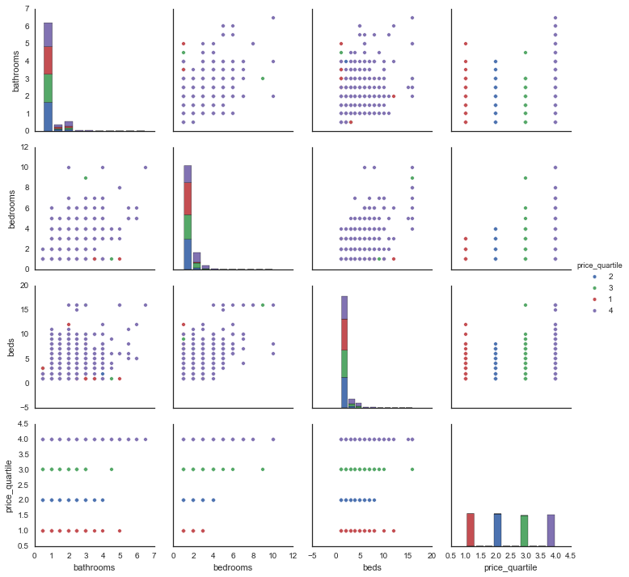


### Customize the plot
* #### fix ordering of legend (hue_order)
* #### use price only for color (vars)
* #### add regression lines (kind)
* #### choose different colors (palette)
* #### add opacity (plot_kws --> alpha)

```python
sns.pairplot(df, hue="price_quartile"
             , hue_order = [1,2,3,4]
             , vars = ['bedrooms', 'bathrooms', 'beds']   
             , plot_kws={'scatter_kws': {'alpha':0.5, 's':15},
                        'line_kws': {'alpha':0.5}}
             , kind = 'reg'
             , palette='BrBG')
```             


```python
sns.pairplot(df, hue="price_quartile"
             , hue_order = [1,2,3,4]
             , vars = ['bedrooms', 'bathrooms', 'beds']   
             , plot_kws={'scatter_kws': {'alpha':0.5, 's':15},
                        'line_kws': {'alpha':0.5}}
             , kind = 'reg'
             , palette='BrBG')
```


    <seaborn.axisgrid.PairGrid at 0x10df31250>


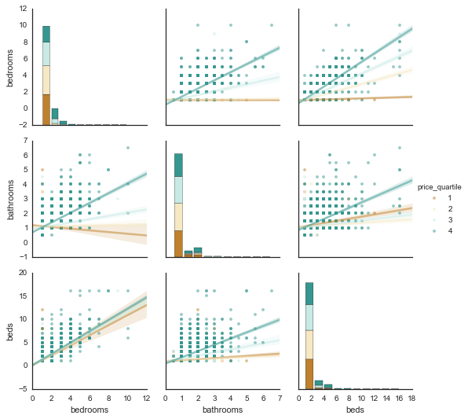


### Add jitter using SQL
* #### What is jitter
* #### Why do we add jitter?
* #### postgres ```random()``` samples from Unif(0,1)
* #### How to add jitter (offset and scale):
```sql
bathrooms + (random()-0.5)*0.5
```

#### Looks scary, but same as previous, plus jitter...


```python
q = """
SELECT bathrooms + (random()-0.5)*0.5 AS bathrooms, 
  bedrooms + (random()-0.5)*0.5 AS bedrooms, 
  beds + (random()-0.5)*0.5 AS beds,
  CASE WHEN price < summary.first_quartile THEN 1
  WHEN price < summary.median THEN 2
  WHEN price < summary.third_quartile THEN 3
  ELSE 4 END AS price_quartile 
FROM listings, dev.x00000_listings_summary summary
"""
df_jitter = query(q).dropna()
sns.pairplot(df_jitter
             , hue="price_quartile"
             , hue_order = [1,2,3,4]
             , vars = ['bedrooms', 'bathrooms', 'beds']   
             , plot_kws={'line_kws': {'alpha':0.5},
                         'scatter_kws': {'alpha':0.25, 's':15}}
             , kind = 'reg'
             , palette='BrBG')
```


    <seaborn.axisgrid.PairGrid at 0x111cf3fd0>


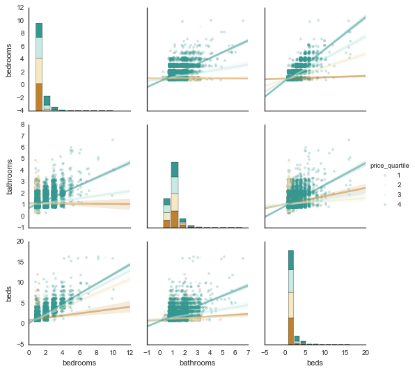


#### Naively plot data -- run into a problem of sample size


```python
q = """
SELECT price, bathrooms, beds, bedrooms
FROM listings
"""
df_raw = query(q).dropna()
df_raw.head()
```


<div>
<table border="1" class="dataframe">
  <thead>
    <tr style="text-align: right;">
      <th></th>
      <th>price</th>
      <th>bathrooms</th>
      <th>beds</th>
      <th>bedrooms</th>
    </tr>
  </thead>
  <tbody>
    <tr>
      <th>0</th>
      <td>110</td>
      <td>1.5</td>
      <td>2</td>
      <td>1</td>
    </tr>
    <tr>
      <th>1</th>
      <td>75</td>
      <td>1.0</td>
      <td>1</td>
      <td>1</td>
    </tr>
    <tr>
      <th>2</th>
      <td>75</td>
      <td>1.0</td>
      <td>1</td>
      <td>1</td>
    </tr>
    <tr>
      <th>3</th>
      <td>145</td>
      <td>1.0</td>
      <td>1</td>
      <td>1</td>
    </tr>
    <tr>
      <th>4</th>
      <td>55</td>
      <td>1.0</td>
      <td>2</td>
      <td>1</td>
    </tr>
  </tbody>
</table>
</div>


```python
# g = sns.FacetGrid(df_raw, col="beds")
# g.map(plt.hist, "price")
```

## Module 7: common workflows

* ### A common workflow: let HAWQ crunch the raw data, receive a small amount of data to your laptop, then manipulate/plot the smaller data
* ### We can compare the process time and size of the output for the 2 workflows:

#### Query all data, then plot the raw data


```python
%%timeit

q = """
SELECT bathrooms
FROM listings
""".format(c)
df = query(q)
print df.info()
sns.distplot(df.dropna(), kde=False, bins = 14)
```

    <class 'pandas.core.frame.DataFrame'>
    Int64Index: 34429 entries, 0 to 34428
    Data columns (total 1 columns):
    bathrooms    34037 non-null float64
    dtypes: float64(1)
    memory usage: 538.0 KB
    None
    <class 'pandas.core.frame.DataFrame'>
    Int64Index: 34429 entries, 0 to 34428
    Data columns (total 1 columns):
    bathrooms    34037 non-null float64
    dtypes: float64(1)
    memory usage: 538.0 KB
    None
    <class 'pandas.core.frame.DataFrame'>
    Int64Index: 34429 entries, 0 to 34428
    Data columns (total 1 columns):
    bathrooms    34037 non-null float64
    dtypes: float64(1)
    memory usage: 538.0 KB
    None
    <class 'pandas.core.frame.DataFrame'>
    Int64Index: 34429 entries, 0 to 34428
    Data columns (total 1 columns):
    bathrooms    34037 non-null float64
    dtypes: float64(1)
    memory usage: 538.0 KB
    None
    1 loops, best of 3: 2.64 s per loop


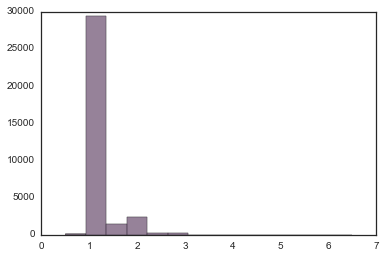


#### Let HAWQ aggregate the data, then plot it (plot is the same)


```python
%%timeit

q = """
SELECT bathrooms, count(*) as samples
FROM listings
GROUP BY 1
ORDER BY 1
"""
df = query(q)
print df.info()
sns.barplot(x="bathrooms", y="samples", data=df)
```

    <class 'pandas.core.frame.DataFrame'>
    Int64Index: 14 entries, 0 to 13
    Data columns (total 2 columns):
    bathrooms    13 non-null float64
    samples      14 non-null int64
    dtypes: float64(1), int64(1)
    memory usage: 336.0 bytes
    None
    <class 'pandas.core.frame.DataFrame'>
    Int64Index: 14 entries, 0 to 13
    Data columns (total 2 columns):
    bathrooms    13 non-null float64
    samples      14 non-null int64
    dtypes: float64(1), int64(1)
    memory usage: 336.0 bytes
    None
    <class 'pandas.core.frame.DataFrame'>
    Int64Index: 14 entries, 0 to 13
    Data columns (total 2 columns):
    bathrooms    13 non-null float64
    samples      14 non-null int64
    dtypes: float64(1), int64(1)
    memory usage: 336.0 bytes
    None
    <class 'pandas.core.frame.DataFrame'>
    Int64Index: 14 entries, 0 to 13
    Data columns (total 2 columns):
    bathrooms    13 non-null float64
    samples      14 non-null int64
    dtypes: float64(1), int64(1)
    memory usage: 336.0 bytes
    None
    1 loops, best of 3: 1.7 s per loop


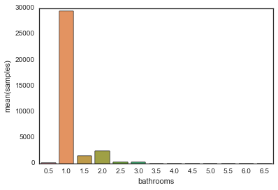


### Use string manipulations to get count and median price by category


```python
dfs = []
for c in ['bathrooms', 'beds', 'bedrooms']:
    q = """
    SELECT {0}, count(*) as samples, median(price) as med_price
    FROM listings
    GROUP BY 1
    ORDER BY 1
    """.format(c)
    dfs.append(query(q).dropna())
```


```python
sns.barplot(x="bathrooms", y="samples", data=dfs[0])
print dfs[0].info()
dfs[0]
```

    <class 'pandas.core.frame.DataFrame'>
    Int64Index: 13 entries, 0 to 12
    Data columns (total 3 columns):
    bathrooms    13 non-null float64
    samples      13 non-null int64
    med_price    13 non-null float64
    dtypes: float64(2), int64(1)
    memory usage: 416.0 bytes
    None


<div>
<table border="1" class="dataframe">
  <thead>
    <tr style="text-align: right;">
      <th></th>
      <th>bathrooms</th>
      <th>samples</th>
      <th>med_price</th>
    </tr>
  </thead>
  <tbody>
    <tr>
      <th>0</th>
      <td>0.5</td>
      <td>122</td>
      <td>80.0</td>
    </tr>
    <tr>
      <th>1</th>
      <td>1.0</td>
      <td>29470</td>
      <td>115.0</td>
    </tr>
    <tr>
      <th>2</th>
      <td>1.5</td>
      <td>1507</td>
      <td>99.0</td>
    </tr>
    <tr>
      <th>3</th>
      <td>2.0</td>
      <td>2409</td>
      <td>160.0</td>
    </tr>
    <tr>
      <th>4</th>
      <td>2.5</td>
      <td>264</td>
      <td>288.5</td>
    </tr>
    <tr>
      <th>5</th>
      <td>3.0</td>
      <td>203</td>
      <td>200.0</td>
    </tr>
    <tr>
      <th>6</th>
      <td>3.5</td>
      <td>24</td>
      <td>550.0</td>
    </tr>
    <tr>
      <th>7</th>
      <td>4.0</td>
      <td>20</td>
      <td>377.5</td>
    </tr>
    <tr>
      <th>8</th>
      <td>4.5</td>
      <td>5</td>
      <td>700.0</td>
    </tr>
    <tr>
      <th>9</th>
      <td>5.0</td>
      <td>5</td>
      <td>800.0</td>
    </tr>
    <tr>
      <th>10</th>
      <td>5.5</td>
      <td>4</td>
      <td>900.0</td>
    </tr>
    <tr>
      <th>11</th>
      <td>6.0</td>
      <td>3</td>
      <td>4500.0</td>
    </tr>
    <tr>
      <th>12</th>
      <td>6.5</td>
      <td>1</td>
      <td>600.0</td>
    </tr>
  </tbody>
</table>
</div>


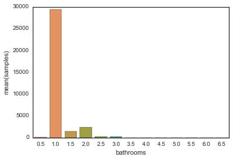


```python
# bar chart of prices
# histogram of listings

sns.barplot(x="bathrooms", y="med_price", data=dfs[0])
```


    <matplotlib.axes._subplots.AxesSubplot at 0x112d09390>


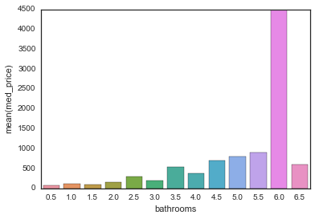


### this demonstrates the value of exploratory data analysis and data visualization... number of bathrooms might seem like it would be a good indicator, but we have very few samples other than 1.0, 1.5, 2.0


```python
sns.barplot(x="beds", y="samples", data=dfs[1])
dfs[1]
```


<div>
<table border="1" class="dataframe">
  <thead>
    <tr style="text-align: right;">
      <th></th>
      <th>beds</th>
      <th>samples</th>
      <th>med_price</th>
    </tr>
  </thead>
  <tbody>
    <tr>
      <th>0</th>
      <td>1</td>
      <td>23245</td>
      <td>99.0</td>
    </tr>
    <tr>
      <th>1</th>
      <td>2</td>
      <td>7367</td>
      <td>150.0</td>
    </tr>
    <tr>
      <th>2</th>
      <td>3</td>
      <td>2286</td>
      <td>195.0</td>
    </tr>
    <tr>
      <th>3</th>
      <td>4</td>
      <td>845</td>
      <td>220.0</td>
    </tr>
    <tr>
      <th>4</th>
      <td>5</td>
      <td>296</td>
      <td>275.0</td>
    </tr>
    <tr>
      <th>5</th>
      <td>6</td>
      <td>184</td>
      <td>299.5</td>
    </tr>
    <tr>
      <th>6</th>
      <td>7</td>
      <td>44</td>
      <td>234.0</td>
    </tr>
    <tr>
      <th>7</th>
      <td>8</td>
      <td>33</td>
      <td>300.0</td>
    </tr>
    <tr>
      <th>8</th>
      <td>9</td>
      <td>15</td>
      <td>399.0</td>
    </tr>
    <tr>
      <th>9</th>
      <td>10</td>
      <td>13</td>
      <td>400.0</td>
    </tr>
    <tr>
      <th>10</th>
      <td>11</td>
      <td>3</td>
      <td>299.0</td>
    </tr>
    <tr>
      <th>11</th>
      <td>12</td>
      <td>3</td>
      <td>300.0</td>
    </tr>
    <tr>
      <th>12</th>
      <td>15</td>
      <td>1</td>
      <td>325.0</td>
    </tr>
    <tr>
      <th>13</th>
      <td>16</td>
      <td>8</td>
      <td>525.0</td>
    </tr>
  </tbody>
</table>
</div>


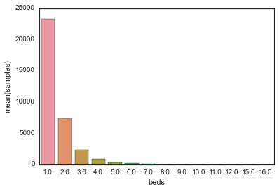


```python
sns.barplot(x="beds", y="med_price", data=dfs[1])
```


    <matplotlib.axes._subplots.AxesSubplot at 0x114ee4cd0>


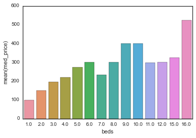


```python
sns.barplot(x="bedrooms", y="samples", data=dfs[2])
dfs[2]
```


<div>
<table border="1" class="dataframe">
  <thead>
    <tr style="text-align: right;">
      <th></th>
      <th>bedrooms</th>
      <th>samples</th>
      <th>med_price</th>
    </tr>
  </thead>
  <tbody>
    <tr>
      <th>0</th>
      <td>1</td>
      <td>25843</td>
      <td>99.0</td>
    </tr>
    <tr>
      <th>1</th>
      <td>2</td>
      <td>4182</td>
      <td>200.0</td>
    </tr>
    <tr>
      <th>2</th>
      <td>3</td>
      <td>1051</td>
      <td>280.0</td>
    </tr>
    <tr>
      <th>3</th>
      <td>4</td>
      <td>236</td>
      <td>399.5</td>
    </tr>
    <tr>
      <th>4</th>
      <td>5</td>
      <td>58</td>
      <td>399.0</td>
    </tr>
    <tr>
      <th>5</th>
      <td>6</td>
      <td>20</td>
      <td>630.0</td>
    </tr>
    <tr>
      <th>6</th>
      <td>7</td>
      <td>6</td>
      <td>925.0</td>
    </tr>
    <tr>
      <th>7</th>
      <td>8</td>
      <td>2</td>
      <td>1000.0</td>
    </tr>
    <tr>
      <th>8</th>
      <td>9</td>
      <td>1</td>
      <td>130.0</td>
    </tr>
    <tr>
      <th>9</th>
      <td>10</td>
      <td>3</td>
      <td>800.0</td>
    </tr>
  </tbody>
</table>
</div>


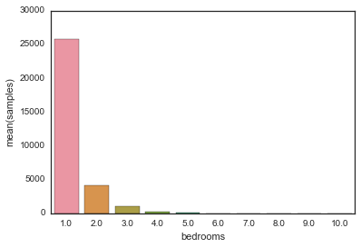


```python
sns.barplot(x="bedrooms", y="med_price", data=dfs[2])
```


    <matplotlib.axes._subplots.AxesSubplot at 0x114ce9190>


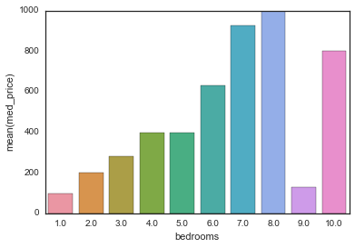


### 9 bedrooms for \$130 seems like an outlier...
* #### Sidebar: displaying a webpage


```python
from selenium import webdriver

q = "SELECT lid FROM listings WHERE bedrooms = 9.0"
url = 'https://www.airbnb.com/rooms/{0}'.format(query(q).values[0,0])

print url
driver = webdriver.Chrome(executable_path='/opt/chromedriver')
driver.get(url)
```

    https://www.airbnb.com/rooms/287417


```python
import requests
from IPython.core.display import HTML
# HTML(requests.get(url).text)
```

### Reusable code:
* #### This is something we might want to re-use so we can make a function to bring up a url:


```python
def listing_url(q, open_where):
    url = 'https://www.airbnb.com/rooms/{0}'.format(query(q).values[0,0])
    if open_where == 'chrome':
        driver = webdriver.Chrome(executable_path='/opt/chromedriver')
        driver.get(url)
    elif open_where == 'notebook':
        HTML(requests.get(url).text)
    elif open_where == 'url':
        return url
    else:
        print "choose 'chrome', 'notebook', or 'url' as second parameter"
```

### In the listing: Extra people: \$35 / night after 2 guests ... we'll return to this later


```python
q = """
SELECT price, price_for_extra_person_native, guests_included, person_capacity
FROM listings
WHERE lid = 
  (SELECT lid FROM listings WHERE bedrooms = 9.0)
"""
query(q)
```


<div>
<table border="1" class="dataframe">
  <thead>
    <tr style="text-align: right;">
      <th></th>
      <th>price</th>
      <th>price_for_extra_person_native</th>
      <th>guests_included</th>
      <th>person_capacity</th>
    </tr>
  </thead>
  <tbody>
    <tr>
      <th>0</th>
      <td>130</td>
      <td>35</td>
      <td>2</td>
      <td>16</td>
    </tr>
  </tbody>
</table>
</div>


#### Same plots on guests_included and person_capacity


```python
dfs = []
for c in ['guests_included', 'person_capacity']:
    q = """
    SELECT {0}, count(*) as samples
    FROM listings
    GROUP BY 1
    ORDER BY 1
    """.format(c)
    dfs.append(query(q).dropna())
```


```python
sns.barplot(x="guests_included", y="samples", data=dfs[0])
```


    <matplotlib.axes._subplots.AxesSubplot at 0x1158009d0>


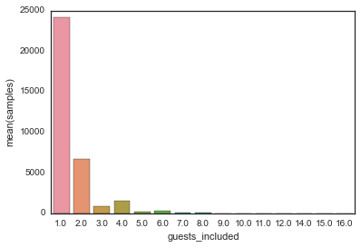


```python
sns.barplot(x="person_capacity", y="samples", data=dfs[1])
```


    <matplotlib.axes._subplots.AxesSubplot at 0x115800d90>


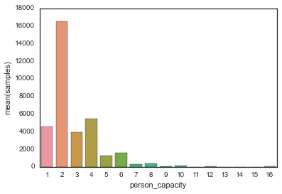


#### More plots


```python
q = """
SELECT price, bathrooms
FROM listings
WHERE bathrooms < 5.0
ORDER BY 2
"""
df = query(q).dropna()
```


```python
ax = sns.violinplot(x="bathrooms", y="price", data=df, inner=None)
ax.set(ylim=(0,500))
```


    [(0, 500)]


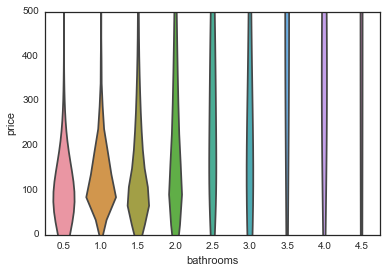


```python
q = """
SELECT price, bedrooms
FROM listings
WHERE bedrooms < 6.5
ORDER BY 2
"""
df = query(q).dropna()
```


```python
ax = sns.violinplot(x="bedrooms", y="price", data=df, inner=None)
ax.set(ylim=(0,500))
```


    [(0, 500)]


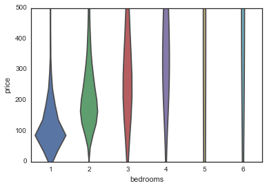


## Break?

### SQL sidebar during break: 
* #### normalizing data (z-scores)
 * #### some models require it
 * #### can help with visualization (everything on the same scale)
* #### subqueries in FROM clause:
```
SELECT <something>
FROM <table>, (SELECT statement) <name>
```


```python
q = """
SELECT (price - stats.ave)/stats.std::float as price_z, 
        (guests_included - ave_g)/std_g::float as guests_z
FROM listings, 
      (SELECT avg(price) as ave, 
          stddev(price) as std, 
          avg(guests_included) as ave_g, 
         stddev(guests_included) as std_g
       FROM listings) stats"""
df = query(q)
df.head()
```


<div>
<table border="1" class="dataframe">
  <thead>
    <tr style="text-align: right;">
      <th></th>
      <th>price_z</th>
      <th>guests_z</th>
    </tr>
  </thead>
  <tbody>
    <tr>
      <th>0</th>
      <td>-0.247518</td>
      <td>0.511497</td>
    </tr>
    <tr>
      <th>1</th>
      <td>-0.467637</td>
      <td>-0.468223</td>
    </tr>
    <tr>
      <th>2</th>
      <td>-0.467637</td>
      <td>-0.468223</td>
    </tr>
    <tr>
      <th>3</th>
      <td>-0.027399</td>
      <td>0.511497</td>
    </tr>
    <tr>
      <th>4</th>
      <td>-0.593420</td>
      <td>0.511497</td>
    </tr>
  </tbody>
</table>
</div>


## Module 8: visualizing categorical variables


```python
q = """
SELECT neighborhood, median(price) AS price
FROM listings
GROUP BY 1
ORDER BY 2 DESC"""

df = query(q)
df.head()
```


<div>
<table border="1" class="dataframe">
  <thead>
    <tr style="text-align: right;">
      <th></th>
      <th>neighborhood</th>
      <th>price</th>
    </tr>
  </thead>
  <tbody>
    <tr>
      <th>0</th>
      <td>Tribeca</td>
      <td>250.0</td>
    </tr>
    <tr>
      <th>1</th>
      <td>Midtown</td>
      <td>223.5</td>
    </tr>
    <tr>
      <th>2</th>
      <td>Union Square</td>
      <td>210.0</td>
    </tr>
    <tr>
      <th>3</th>
      <td>Noho</td>
      <td>209.0</td>
    </tr>
    <tr>
      <th>4</th>
      <td>Times Square/Theatre District</td>
      <td>205.0</td>
    </tr>
  </tbody>
</table>
</div>


```python
g = sns.PairGrid(df.sort_values(by='price', ascending=False),
                 x_vars=['price'], y_vars=["neighborhood"],
                 size=20, aspect=.25)

g.map(sns.stripplot, size=10, orient="h",
      palette="PRGn", edgecolor="gray")
```


    <seaborn.axisgrid.PairGrid at 0x115f94510>


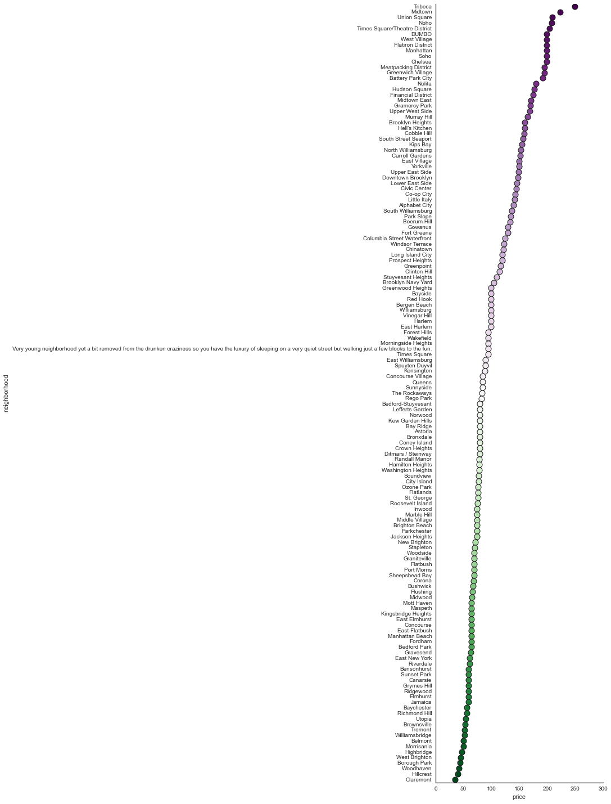


### What happened?! 


```python
q = """
SELECT * 
FROM listings
WHERE neighborhood LIKE 'Very%'"""

listing_url(q, 'chrome')
```


```python
import json
api = 'https://api.airbnb.com/v2/listings/{0}?client_id=3092nxybyb0otqw18e8nh5nty&_format=v1_legacy_for_p3'\
        .format(query(q).lid.values[0])
listing_data = json.loads(requests.get(api).text)
listing_data
```


    {u'listing': {u'access': u'You have access to the shared kitchen, bathroom, and living room in addition to a private bedroom with private HDTV.',
      u'address': u'New York, NY, United States',
      u'amenities': [u'TV',
       u'Cable TV',
       u'Internet',
       u'Wireless Internet',
       u'Air Conditioning',
       u'Kitchen',
       u'Heating',
       u'Smoke Detector',
       u'Carbon Monoxide Detector',
       u'First Aid Kit',
       u'Essentials',
       u'Shampoo'],
      u'amenities_ids': [1, 2, 3, 4, 5, 8, 30, 35, 36, 37, 40, 41],
      u'bathrooms': 1.0,
      u'bed_type': u'Real Bed',
      u'bed_type_category': u'real_bed',
      u'bedrooms': 1,
      u'beds': 1,
      u'calendar_updated_at': u'2 months ago',
      u'cancel_policy': 3,
      u'cancel_policy_short_str': u'Flexible',
      u'cancellation_policy': u'flexible',
      u'check_in_time': 12,
      u'check_out_time': 16,
      u'city': u'New York',
      u'cleaning_fee_native': None,
      u'collection_ids': None,
      u'country': u'United States',
      u'country_code': u'US',
      u'currency_symbol_left': u'$',
      u'currency_symbol_right': None,
      u'description': u"Private room available in newly-renovated 2-bedroom East Village apartment located on a quiet street but still walking distance to Tompkins Square, East River Park, trendy Lower East Side and tons of excellent bars and restaurants all around. Close to the F train, M14 bus, and includes wireless internet.\n\nExposed brick and new renovation make this a clean, cozy home with true East Village style! On a third floor walk-up so be prepared to do the stairs.\n\nYou have access to the shared kitchen, bathroom, and living room in addition to a private bedroom with private HDTV.\n\nThis is a 2-bedroom apartment, not a full private rental, and I work from home as a marketing consultant so I am generally home during the day but you will have a private bedroom for your own space and I imagine you will be out enjoying our amazing city all day anyway! I often have friends who stop by to watch tv or play some darts so you will likely meet some fun people but we always respect the guests. We are a very social group but it's important to me that the apartment be kept clean and comfortable.\n\nI am right in the middle of a very young and fun neighborhood yet the apartment is a couple streets away from the crazy bars so you have the luxury of sleeping on a very quiet street but walking just a few blocks to the fun.\n\nF train is a 10 minute walk and the bus that takes you to every subway is just one block away.\n\nFreshly cleaned bed linens and towels provided.",
      u'description_locale': u'en',
      u'experiences_offered': u'none',
      u'extra_user_info': None,
      u'extras_price_native': None,
      u'force_mobile_legal_modal': True,
      u'guests_included': 1,
      u'has_agreed_to_legal_terms': True,
      u'has_availability': True,
      u'has_double_blind_reviews': False,
      u'has_viewed_cleaning': None,
      u'has_viewed_ib_perf_dashboard_panel': None,
      u'has_viewed_terms': None,
      u'house_rules': u'No smokers please; visiting pets are a possibility but we would need to discuss',
      u'id': 1029482,
      u'in_building': False,
      u'in_toto_area': False,
      u'instant_book_welcome_message': None,
      u'instant_bookable': False,
      u'interaction': u"This is a 2-bedroom apartment, not a full private rental, and I work from home as a marketing consultant so I am generally home during the day but you will have a private bedroom for your own space and I imagine you will be out enjoying our amazing city all day anyway! I often have friends who stop by to watch tv or play some darts so you will likely meet some fun people but we always respect the guests. We are a very social group but it's important to me that the apartment be kept clean and comfortable.",
      u'is_location_exact': False,
      u'jurisdiction_names': None,
      u'jurisdiction_rollout_names': None,
      u'language': u'en',
      u'lat': 40.72457249315951,
      u'license': None,
      u'listing_cleaning_fee_native': None,
      u'listing_monthly_price_native': None,
      u'listing_native_currency': u'USD',
      u'listing_occupancy_info': {u'show_occupancy_message': False},
      u'listing_price_for_extra_person_native': 0,
      u'listing_security_deposit_native': None,
      u'listing_weekend_price_native': None,
      u'listing_weekly_price_native': None,
      u'lng': -73.97794967210409,
      u'locale': u'en',
      u'map_image_url': u'https://maps.googleapis.com/maps/api/staticmap?maptype=roadmap&markers=40.72457249315951%2C-73.97794967210409&size=480x320&zoom=15&client=gme-airbnbinc&channel=monorail-prod&signature=CDszADSKqpKvLqWRbFIlipDQU2o%3D',
      u'market': u'New York',
      u'max_nights': 14,
      u'max_nights_input_value': 14,
      u'medium_url': u'https://a0.muscache.com/im/pictures/15472580/43a24d36_original.jpg?aki_policy=medium',
      u'min_nights': 3,
      u'min_nights_input_value': 3,
      u'monthly_price_factor': 1.0,
      u'monthly_price_native': None,
      u'name': u'Private Room w TV in East Village',
      u'native_currency': u'USD',
      u'neighborhood': u'Very young neighborhood yet a bit removed from the drunken craziness so you have the luxury of sleeping on a very quiet street but walking just a few blocks to the fun.',
      u'neighborhood_overview': u'I am right in the middle of a very young and fun neighborhood yet the apartment is a couple streets away from the crazy bars so you have the luxury of sleeping on a very quiet street but walking just a few blocks to the fun.',
      u'notes': u'Freshly cleaned bed linens and towels provided.',
      u'person_capacity': 1,
      u'photos': [{u'caption': u'Welcome!',
        u'id': 10289646,
        u'picture': u'https://a0.muscache.com/ac/pictures/15472580/43a24d36_original.jpg?interpolation=lanczos-none&size=large_cover&output-format=jpg&output-quality=70',
        u'sort_order': 1,
        u'thumbnail': u'https://a0.muscache.com/ac/pictures/15472580/43a24d36_original.jpg?interpolation=lanczos-none&size=small&output-format=jpg&output-quality=70',
        u'xl_picture': u'https://a0.muscache.com/im/pictures/15472580/43a24d36_original.jpg?aki_policy=x_large'},
       {u'caption': u"Yes, you are welcome to play some darts if you'd like!",
        u'id': 10289647,
        u'picture': u'https://a2.muscache.com/ac/pictures/15472622/3bc36087_original.jpg?interpolation=lanczos-none&size=large_cover&output-format=jpg&output-quality=70',
        u'sort_order': 2,
        u'thumbnail': u'https://a2.muscache.com/ac/pictures/15472622/3bc36087_original.jpg?interpolation=lanczos-none&size=small&output-format=jpg&output-quality=70',
        u'xl_picture': u'https://a2.muscache.com/im/pictures/15472622/3bc36087_original.jpg?aki_policy=x_large'},
       {u'caption': u'Very clean, newly-renovated kitchen with new appliances',
        u'id': 10289648,
        u'picture': u'https://a1.muscache.com/ac/pictures/15472614/c1340e5e_original.jpg?interpolation=lanczos-none&size=large_cover&output-format=jpg&output-quality=70',
        u'sort_order': 3,
        u'thumbnail': u'https://a1.muscache.com/ac/pictures/15472614/c1340e5e_original.jpg?interpolation=lanczos-none&size=small&output-format=jpg&output-quality=70',
        u'xl_picture': u'https://a1.muscache.com/im/pictures/15472614/c1340e5e_original.jpg?aki_policy=x_large'},
       {u'caption': u'Very clean bathroom',
        u'id': 10289649,
        u'picture': u'https://a0.muscache.com/ac/pictures/15472634/cfb5b831_original.jpg?interpolation=lanczos-none&size=large_cover&output-format=jpg&output-quality=70',
        u'sort_order': 4,
        u'thumbnail': u'https://a0.muscache.com/ac/pictures/15472634/cfb5b831_original.jpg?interpolation=lanczos-none&size=small&output-format=jpg&output-quality=70',
        u'xl_picture': u'https://a0.muscache.com/im/pictures/15472634/cfb5b831_original.jpg?aki_policy=x_large'},
       {u'caption': u'Your bedroom with double bed, desk and window AC...',
        u'id': 10289650,
        u'picture': u'https://a1.muscache.com/ac/pictures/24047917/44eb91ea_original.jpg?interpolation=lanczos-none&size=large_cover&output-format=jpg&output-quality=70',
        u'sort_order': 5,
        u'thumbnail': u'https://a1.muscache.com/ac/pictures/24047917/44eb91ea_original.jpg?interpolation=lanczos-none&size=small&output-format=jpg&output-quality=70',
        u'xl_picture': u'https://a1.muscache.com/im/pictures/24047917/44eb91ea_original.jpg?aki_policy=x_large'},
       {u'caption': u'...plus private HDTV for relaxing.',
        u'id': 10289651,
        u'picture': u'https://a1.muscache.com/ac/pictures/27977909/f54fd7b6_original.jpg?interpolation=lanczos-none&size=large_cover&output-format=jpg&output-quality=70',
        u'sort_order': 6,
        u'thumbnail': u'https://a1.muscache.com/ac/pictures/27977909/f54fd7b6_original.jpg?interpolation=lanczos-none&size=small&output-format=jpg&output-quality=70',
        u'xl_picture': u'https://a1.muscache.com/im/pictures/27977909/f54fd7b6_original.jpg?aki_policy=x_large'}],
      u'picture_captions': [u'Welcome!',
       u"Yes, you are welcome to play some darts if you'd like!",
       u'Very clean, newly-renovated kitchen with new appliances',
       u'Very clean bathroom',
       u'Your bedroom with double bed, desk and window AC...',
       u'...plus private HDTV for relaxing.'],
      u'picture_count': 6,
      u'picture_url': u'https://a0.muscache.com/ac/pictures/15472580/43a24d36_original.jpg?interpolation=lanczos-none&size=large_cover&output-format=jpg&output-quality=70',
      u'picture_urls': [u'https://a0.muscache.com/ac/pictures/15472580/43a24d36_original.jpg?interpolation=lanczos-none&size=large_cover&output-format=jpg&output-quality=70',
       u'https://a2.muscache.com/ac/pictures/15472622/3bc36087_original.jpg?interpolation=lanczos-none&size=large_cover&output-format=jpg&output-quality=70',
       u'https://a1.muscache.com/ac/pictures/15472614/c1340e5e_original.jpg?interpolation=lanczos-none&size=large_cover&output-format=jpg&output-quality=70',
       u'https://a0.muscache.com/ac/pictures/15472634/cfb5b831_original.jpg?interpolation=lanczos-none&size=large_cover&output-format=jpg&output-quality=70',
       u'https://a1.muscache.com/ac/pictures/24047917/44eb91ea_original.jpg?interpolation=lanczos-none&size=large_cover&output-format=jpg&output-quality=70',
       u'https://a1.muscache.com/ac/pictures/27977909/f54fd7b6_original.jpg?interpolation=lanczos-none&size=large_cover&output-format=jpg&output-quality=70'],
      u'price': 95,
      u'price_for_extra_person_native': 0,
      u'price_formatted': u'$95',
      u'price_native': 95,
      u'property_type': u'Apartment',
      u'property_type_id': 1,
      u'public_address': u'New York, NY, United States',
      u'recent_review': {u'review': {u'comments': u'The room was comfortable and a good size. The apartment is in a great, trendy area only a few streets away from cafes and bars. Be prepared to lug your luggage up four flights on your own! Kelly was approachable if you had a question.',
        u'created_at': u'2015-10-25T12:51:08Z',
        u'id': 51909573,
        u'listing_id': 1029482,
        u'reviewee_id': 5664550,
        u'reviewer': {u'user': {u'first_name': u'Casey',
          u'has_profile_pic': True,
          u'id': 42433375,
          u'picture_url': u'https://a2.muscache.com/ac/users/42433375/profile_pic/1440474177/original.jpg?interpolation=lanczos-none&crop=w:w;*,*&crop=h:h;*,*&resize=225:*&output-format=jpg&output-quality=70',
          u'thumbnail_url': u'https://a2.muscache.com/ac/users/42433375/profile_pic/1440474177/original.jpg?interpolation=lanczos-none&crop=w:w;*,*&crop=h:h;*,*&resize=50:*&output-format=jpg&output-quality=70'}},
        u'reviewer_id': 42433375,
        u'role': u'guest'}},
      u'require_guest_phone_verification': False,
      u'require_guest_profile_picture': False,
      u'requires_license': False,
      u'review_rating_accuracy': 9,
      u'review_rating_checkin': 9,
      u'review_rating_cleanliness': 9,
      u'review_rating_communication': 10,
      u'review_rating_location': 9,
      u'review_rating_value': 9,
      u'reviews_count': 22,
      u'room_type': u'Private room',
      u'room_type_category': u'private_room',
      u'security_deposit_formatted': u'',
      u'security_deposit_native': None,
      u'security_price_native': None,
      u'smart_location': u'New York, NY',
      u'space': u'Exposed brick and new renovation make this a clean, cozy home with true East Village style! On a third floor walk-up so be prepared to do the stairs.',
      u'special_offer': None,
      u'square_feet': None,
      u'star_rating': 4.5,
      u'state': u'NY',
      u'summary': u'Private room available in newly-renovated 2-bedroom East Village apartment located on a quiet street but still walking distance to Tompkins Square, East River Park, trendy Lower East Side and tons of excellent bars and restaurants all around. Close to the F train, M14 bus, and includes wireless internet.',
      u'thumbnail_url': u'https://a0.muscache.com/ac/pictures/15472580/43a24d36_original.jpg?interpolation=lanczos-none&size=small&output-format=jpg&output-quality=70',
      u'thumbnail_urls': [u'https://a0.muscache.com/ac/pictures/15472580/43a24d36_original.jpg?interpolation=lanczos-none&size=small&output-format=jpg&output-quality=70',
       u'https://a2.muscache.com/ac/pictures/15472622/3bc36087_original.jpg?interpolation=lanczos-none&size=small&output-format=jpg&output-quality=70',
       u'https://a1.muscache.com/ac/pictures/15472614/c1340e5e_original.jpg?interpolation=lanczos-none&size=small&output-format=jpg&output-quality=70',
       u'https://a0.muscache.com/ac/pictures/15472634/cfb5b831_original.jpg?interpolation=lanczos-none&size=small&output-format=jpg&output-quality=70',
       u'https://a1.muscache.com/ac/pictures/24047917/44eb91ea_original.jpg?interpolation=lanczos-none&size=small&output-format=jpg&output-quality=70',
       u'https://a1.muscache.com/ac/pictures/27977909/f54fd7b6_original.jpg?interpolation=lanczos-none&size=small&output-format=jpg&output-quality=70'],
      u'time_zone_name': u'America/New_York',
      u'toto_opt_in': None,
      u'transit': u'F train is a 10 minute walk and the bus that takes you to every subway is just one block away.',
      u'user': {u'user': {u'about': u"I'm a 34yo female who works from home as a marketing consultant so my hours are very flexible. I tend to stay up late and sleep late so there won't be much morning competition for the bathroom. I'm very laid back, very friendly and happy to host anyone who is passing through my wonderful city!",
        u'first_name': u'Kelly',
        u'has_profile_pic': True,
        u'id': 5664550,
        u'identity_verified': False,
        u'is_superhost': False,
        u'picture_url': u'https://a2.muscache.com/ac/users/5664550/profile_pic/1409860717/original.jpg?interpolation=lanczos-none&crop=w:w;*,*&crop=h:h;*,*&resize=225:*&output-format=jpg&output-quality=70',
        u'reviewee_count': 22,
        u'thumbnail_url': u'https://a2.muscache.com/ac/users/5664550/profile_pic/1409860717/original.jpg?interpolation=lanczos-none&crop=w:w;*,*&crop=h:h;*,*&resize=50:*&output-format=jpg&output-quality=70'}},
      u'user_id': 5664550,
      u'weekly_price_factor': 1.0,
      u'weekly_price_native': None,
      u'wireless_info': None,
      u'xl_picture_url': u'https://a0.muscache.com/ac/pictures/15472580/43a24d36_original.jpg?interpolation=lanczos-none&size=x_large_cover&output-format=jpg&output-quality=70',
      u'xl_picture_urls': [u'https://a0.muscache.com/ac/pictures/15472580/43a24d36_original.jpg?interpolation=lanczos-none&size=x_large_cover&output-format=jpg&output-quality=70',
       u'https://a2.muscache.com/ac/pictures/15472622/3bc36087_original.jpg?interpolation=lanczos-none&size=x_large_cover&output-format=jpg&output-quality=70',
       u'https://a1.muscache.com/ac/pictures/15472614/c1340e5e_original.jpg?interpolation=lanczos-none&size=x_large_cover&output-format=jpg&output-quality=70',
       u'https://a0.muscache.com/ac/pictures/15472634/cfb5b831_original.jpg?interpolation=lanczos-none&size=x_large_cover&output-format=jpg&output-quality=70',
       u'https://a1.muscache.com/ac/pictures/24047917/44eb91ea_original.jpg?interpolation=lanczos-none&size=x_large_cover&output-format=jpg&output-quality=70',
       u'https://a1.muscache.com/ac/pictures/27977909/f54fd7b6_original.jpg?interpolation=lanczos-none&size=x_large_cover&output-format=jpg&output-quality=70'],
      u'zipcode': None},
     u'metadata': {}}


```python
listing_data['listing']['neighborhood']
```


    u'Very young neighborhood yet a bit removed from the drunken craziness so you have the luxury of sleeping on a very quiet street but walking just a few blocks to the fun.'


### Omit the erroneous value


```python
q = """
SELECT neighborhood, median(price) AS price
FROM listings
WHERE neighborhood NOT LIKE 'Very%'
GROUP BY 1
ORDER BY 2 DESC"""
df = query(q)
```


```python
# Make the PairGrid
g = sns.PairGrid(df.sort_values(by='price', ascending=False),
                 x_vars=['price'], y_vars=["neighborhood"],
                 size=30, aspect=.25)

# Draw a dot plot using the stripplot function
g.map(sns.stripplot, size=10, orient="h",
      palette="PRGn", edgecolor="gray")
```


    <seaborn.axisgrid.PairGrid at 0x1189bf0d0>


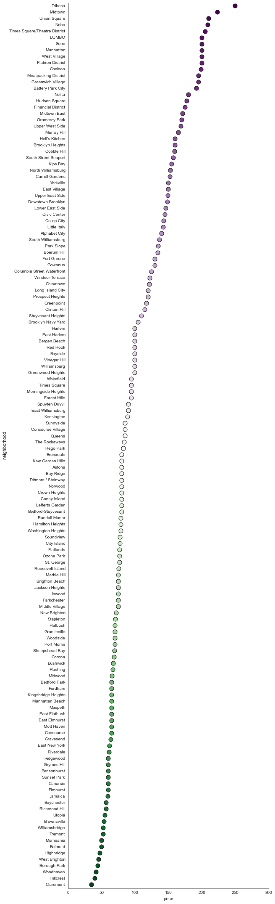


## Module 9: Postgres Arrays

* #### The amenities field was filled with text


```python
q = """
SELECT amenities
FROM listings
LIMIT 5"""
query(q)
```


<div>
<table border="1" class="dataframe">
  <thead>
    <tr style="text-align: right;">
      <th></th>
      <th>amenities</th>
    </tr>
  </thead>
  <tbody>
    <tr>
      <th>0</th>
      <td>Internet,Wireless Internet,Air Conditioning,Ki...</td>
    </tr>
    <tr>
      <th>1</th>
      <td>Internet,Wireless Internet,Air Conditioning,Ki...</td>
    </tr>
    <tr>
      <th>2</th>
      <td>TV,Internet,Wireless Internet,Air Conditioning...</td>
    </tr>
    <tr>
      <th>3</th>
      <td>TV,Cable TV,Internet,Wireless Internet,Air Con...</td>
    </tr>
    <tr>
      <th>4</th>
      <td>TV,Internet,Wireless Internet,Air Conditioning...</td>
    </tr>
  </tbody>
</table>
</div>


### Postgres has native arrays that work as expected and have built-in methods
* #### string_to_array method


```python
q = """
SELECT string_to_array(amenities,',')
FROM listings
LIMIT 5"""
query(q)
```


<div>
<table border="1" class="dataframe">
  <thead>
    <tr style="text-align: right;">
      <th></th>
      <th>string_to_array</th>
    </tr>
  </thead>
  <tbody>
    <tr>
      <th>0</th>
      <td>[Internet, Wireless Internet, Air Conditioning...</td>
    </tr>
    <tr>
      <th>1</th>
      <td>[Internet, Wireless Internet, Air Conditioning...</td>
    </tr>
    <tr>
      <th>2</th>
      <td>[TV, Internet, Wireless Internet, Air Conditio...</td>
    </tr>
    <tr>
      <th>3</th>
      <td>[TV, Cable TV, Internet, Wireless Internet, Ai...</td>
    </tr>
    <tr>
      <th>4</th>
      <td>[TV, Internet, Wireless Internet, Air Conditio...</td>
    </tr>
  </tbody>
</table>
</div>


```python
q = """
SELECT DISTINCT(unnest(string_to_array(amenities,','))) AS amenities
FROM listings
"""
amenities = query(q)
all_amenities = sorted(list(amenities.amenities.values))
print all_amenities
```

    ['24-Hour Check-in', 'Air Conditioning', 'Breakfast', 'Buzzer/Wireless Intercom', 'Cable TV', 'Carbon Monoxide Detector', 'Cat(s)', 'Dog(s)', 'Doorman', 'Dryer', 'Elevator in Building', 'Essentials', 'Family/Kid Friendly', 'Fire Extinguisher', 'First Aid Kit', 'Free Parking on Premises', 'Gym', 'Hair Dryer', 'Hangers', 'Heating', 'Hot Tub', 'Indoor Fireplace', 'Internet', 'Iron', 'Kitchen', 'Laptop Friendly Workspace', 'Lock on Bedroom Door', 'Other pet(s)', 'Pets Allowed', 'Pets live on this property', 'Pool', 'Safety Card', 'Shampoo', 'Smoke Detector', 'Smoking Allowed', 'Suitable for Events', 'TV', 'Washer', 'Washer / Dryer', 'Wheelchair Accessible', 'Wireless Internet']


## Break?

## Module 10: PL/Python
* ### in order to use the amenities field, we might want a table of binary values indicating whether that listing has that corresponding amenity
* ### this is a pain in pure SQL (41 case statements?)
* ### first, let's think about it in pure python:
 * we have a list of all possible amenities
 * we have a list of amenities for each listing


```python
q = """
SELECT lid, string_to_array(amenities,',')
FROM listings
LIMIT 1"""
listing_amenities = query(q)
listing_amenities = list(listing_amenities.string_to_array.values[0])
listing_amenities
```


    ['Internet',
     'Wireless Internet',
     'Air Conditioning',
     'Kitchen',
     'Heating',
     'Smoke Detector',
     'Carbon Monoxide Detector',
     'Essentials']


### Loops vs. list comprehension


```python
%%timeit
vec = []
for a in all_amenities:
    vec.append(int(a in listing_amenities))
```

    100000 loops, best of 3: 11.6 µs per loop


```python
%%timeit
vec = [int(a in listing_amenities) for a in all_amenities]
```

    100000 loops, best of 3: 9.71 µs per loop


```python
vec = [a for a in all_amenities]
print vec
```

    ['24-Hour Check-in', 'Air Conditioning', 'Breakfast', 'Buzzer/Wireless Intercom', 'Cable TV', 'Carbon Monoxide Detector', 'Cat(s)', 'Dog(s)', 'Doorman', 'Dryer', 'Elevator in Building', 'Essentials', 'Family/Kid Friendly', 'Fire Extinguisher', 'First Aid Kit', 'Free Parking on Premises', 'Gym', 'Hair Dryer', 'Hangers', 'Heating', 'Hot Tub', 'Indoor Fireplace', 'Internet', 'Iron', 'Kitchen', 'Laptop Friendly Workspace', 'Lock on Bedroom Door', 'Other pet(s)', 'Pets Allowed', 'Pets live on this property', 'Pool', 'Safety Card', 'Shampoo', 'Smoke Detector', 'Smoking Allowed', 'Suitable for Events', 'TV', 'Washer', 'Washer / Dryer', 'Wheelchair Accessible', 'Wireless Internet']


### PL/Python Syntax
```sql
CREATE OR REPLACE FUNCTION <name>(<parameter> <datatype>)
    RETURNS <return type>
AS
$$  
	<python code>
$$ 
LANGUAGE PLPYTHONU;```

### Return types
* #### return an array:


```python
q = """
CREATE OR REPLACE FUNCTION dev.amenities_arr(listing_amenities text[])
    RETURNS int[]
AS
$$  
    all_amenities = list({0})
    
    return [int(a in listing_amenities) for a in all_amenities]
$$ 
LANGUAGE PLPYTHONU;""".format(all_amenities)
print q
query(q, False)
```

    
    CREATE OR REPLACE FUNCTION dev.amenities_arr(listing_amenities text[])
        RETURNS int[]
    AS
    $$  
        all_amenities = list(['24-Hour Check-in', 'Air Conditioning', 'Breakfast', 'Buzzer/Wireless Intercom', 'Cable TV', 'Carbon Monoxide Detector', 'Cat(s)', 'Dog(s)', 'Doorman', 'Dryer', 'Elevator in Building', 'Essentials', 'Family/Kid Friendly', 'Fire Extinguisher', 'First Aid Kit', 'Free Parking on Premises', 'Gym', 'Hair Dryer', 'Hangers', 'Heating', 'Hot Tub', 'Indoor Fireplace', 'Internet', 'Iron', 'Kitchen', 'Laptop Friendly Workspace', 'Lock on Bedroom Door', 'Other pet(s)', 'Pets Allowed', 'Pets live on this property', 'Pool', 'Safety Card', 'Shampoo', 'Smoke Detector', 'Smoking Allowed', 'Suitable for Events', 'TV', 'Washer', 'Washer / Dryer', 'Wheelchair Accessible', 'Wireless Internet'])
        
        return [int(a in listing_amenities) for a in all_amenities]
    $$ 
    LANGUAGE PLPYTHONU;


```python
q = """
SELECT lid, dev.amenities_arr(string_to_array(amenities,','))
FROM listings
LIMIT 1"""
query(q)
```


<div>
<table border="1" class="dataframe">
  <thead>
    <tr style="text-align: right;">
      <th></th>
      <th>lid</th>
      <th>amenities_arr</th>
    </tr>
  </thead>
  <tbody>
    <tr>
      <th>0</th>
      <td>6029332</td>
      <td>[0, 1, 0, 0, 0, 1, 0, 0, 0, 0, 0, 1, 0, 0, 0, ...</td>
    </tr>
  </tbody>
</table>
</div>


### that's great, but how do we know which index corresponds to which? 
* #### this is where custom types come in


```python
q = 'CREATE TYPE amenities_type AS (\n' + \
'\n'.join([', ' + a.replace(' ','_')
                   .replace('-','_')
                   .replace('/','_')
                   .replace('24','x24')
                   .replace('(','')
                   .replace(')','') \
                + ' SMALLINT' for a in all_amenities])[2:] + \
')'
print q[:100]
print '...'
print q[-100:]
query(q, False)
```

    CREATE TYPE amenities_type AS (
    x24_Hour_Check_in SMALLINT
    , Air_Conditioning SMALLINT
    , Breakfast S
    ...
    er SMALLINT
    , Washer___Dryer SMALLINT
    , Wheelchair_Accessible SMALLINT
    , Wireless_Internet SMALLINT)


#### same as previous PL/Python function, except with a custom return type


```python
q = """
CREATE OR REPLACE FUNCTION dev.amenities_vec(listing_amenities text[])
    RETURNS amenities_type
AS
$$  
    all_amenities = list({0})
    
    return [int(a in listing_amenities) for a in all_amenities]
$$ 
LANGUAGE PLPYTHONU;""".format(all_amenities)
query(q, False)
```


```python
q = """
SELECT lid, dev.amenities_vec(string_to_array(amenities,','))
FROM listings
LIMIT 1"""
query(q)
```


<div>
<table border="1" class="dataframe">
  <thead>
    <tr style="text-align: right;">
      <th></th>
      <th>lid</th>
      <th>amenities_vec</th>
    </tr>
  </thead>
  <tbody>
    <tr>
      <th>0</th>
      <td>6029332</td>
      <td>(0,1,0,0,0,1,0,0,0,0,0,1,0,0,0,0,0,0,0,1,0,0,1...</td>
    </tr>
  </tbody>
</table>
</div>


#### The magic...


```python
q = """
SELECT lid, (dev.amenities_vec(string_to_array(amenities,','))).*
FROM listings
LIMIT 1"""
query(q)
```


<div>
<table border="1" class="dataframe">
  <thead>
    <tr style="text-align: right;">
      <th></th>
      <th>lid</th>
      <th>x24_hour_check_in</th>
      <th>air_conditioning</th>
      <th>breakfast</th>
      <th>buzzer_wireless_intercom</th>
      <th>cable_tv</th>
      <th>carbon_monoxide_detector</th>
      <th>cats</th>
      <th>dogs</th>
      <th>doorman</th>
      <th>...</th>
      <th>safety_card</th>
      <th>shampoo</th>
      <th>smoke_detector</th>
      <th>smoking_allowed</th>
      <th>suitable_for_events</th>
      <th>tv</th>
      <th>washer</th>
      <th>washer___dryer</th>
      <th>wheelchair_accessible</th>
      <th>wireless_internet</th>
    </tr>
  </thead>
  <tbody>
    <tr>
      <th>0</th>
      <td>6029332</td>
      <td>0</td>
      <td>1</td>
      <td>0</td>
      <td>0</td>
      <td>0</td>
      <td>1</td>
      <td>0</td>
      <td>0</td>
      <td>0</td>
      <td>...</td>
      <td>0</td>
      <td>0</td>
      <td>1</td>
      <td>0</td>
      <td>0</td>
      <td>0</td>
      <td>0</td>
      <td>0</td>
      <td>0</td>
      <td>1</td>
    </tr>
  </tbody>
</table>
<p>1 rows × 42 columns</p>
</div>


### Summary of what we just did
* #### turned a text field into an array
* #### dynamically created a custom type containing all amenities: nothing is hard-coded!
* #### we didn't have to copy-paste 41 names or create 41 case statements!
* #### we were able to expand into a row with 41 columns
* #### we can now make a table containing the presence of all amenities by listing, and compute 

## Views vs. Internal Tables

#### upfront time vs. query time

### Views

* #### View via internal table


```python
%%time
q = """
CREATE OR REPLACE VIEW dev.x00010_amenities_view AS
SELECT lid, (dev.amenities_vec(string_to_array(amenities,','))).*
FROM listings
WHERE amenities <> ''
"""
query(q, False)
```

    CPU times: user 263 µs, sys: 412 µs, total: 675 µs
    Wall time: 68.6 ms


```python
%%time
q = """
SELECT *
FROM dev.x00010_amenities_view
"""
query(q)
```

    CPU times: user 406 ms, sys: 119 ms, total: 524 ms
    Wall time: 3min 33s


* #### View via external table


```python
%%time
q = """
CREATE OR REPLACE VIEW dev.x00010_amenities_view_ext AS
SELECT lid, (dev.amenities_vec(string_to_array(amenities,','))).*
FROM ext_listings
WHERE amenities <> ''
"""
query(q, False)
```

    CPU times: user 276 µs, sys: 639 µs, total: 915 µs
    Wall time: 34.1 ms


```python
%%time
q = """
SELECT *
FROM dev.x00010_amenities_view_ext
"""
query(q)
```

    CPU times: user 391 ms, sys: 77.2 ms, total: 468 ms
    Wall time: 3min 24s


### Internal Tables


```python
%%time
q = """
CREATE TABLE dev.x00010_amenities_table AS
SELECT lid, (dev.amenities_vec(string_to_array(amenities,','))).*
FROM listings
WHERE amenities <> ''
DISTRIBUTED RANDOMLY
"""
query(q, False)
```

    CPU times: user 13.7 ms, sys: 9.82 ms, total: 23.6 ms
    Wall time: 4min 12s


```python
%%time
q = """
SELECT *
FROM dev.x00010_amenities_table
"""
query(q)
```

    CPU times: user 363 ms, sys: 85.6 ms, total: 448 ms
    Wall time: 2.22 s


## Break and brainstorm: analyze the amenities table

### How can we create queries for the following:
* #### what amenities are most common?
* #### how can we look at which might be the most informative for price?
* #### how might we visualize this?


```python
q = """
SELECT price, a.doorman
FROM dev.x00010_amenities_table a, listings l
WHERE a.lid = l.lid
"""
df = query(q)
df.head()
```


<div>
<table border="1" class="dataframe">
  <thead>
    <tr style="text-align: right;">
      <th></th>
      <th>price</th>
      <th>doorman</th>
    </tr>
  </thead>
  <tbody>
    <tr>
      <th>0</th>
      <td>110</td>
      <td>0</td>
    </tr>
    <tr>
      <th>1</th>
      <td>75</td>
      <td>0</td>
    </tr>
    <tr>
      <th>2</th>
      <td>75</td>
      <td>0</td>
    </tr>
    <tr>
      <th>3</th>
      <td>145</td>
      <td>0</td>
    </tr>
    <tr>
      <th>4</th>
      <td>55</td>
      <td>0</td>
    </tr>
  </tbody>
</table>
</div>


```python
q = ["""
SELECT sum(doorman)::float/count(doorman)::float AS prop
FROM (SELECT price, a.*
      FROM dev.x00010_amenities_table a, listings l
      WHERE a.lid = l.lid) q
""","""
SELECT doorman, avg(price)
FROM (SELECT price, a.*
      FROM dev.x00010_amenities_table a, listings l
      WHERE a.lid = l.lid) q
GROUP BY doorman
"""]
```


```python
query(q[0])
```


<div>
<table border="1" class="dataframe">
  <thead>
    <tr style="text-align: right;">
      <th></th>
      <th>prop</th>
    </tr>
  </thead>
  <tbody>
    <tr>
      <th>0</th>
      <td>0.11433</td>
    </tr>
  </tbody>
</table>
</div>


```python
query(q[1])
```


<div>
<table border="1" class="dataframe">
  <thead>
    <tr style="text-align: right;">
      <th></th>
      <th>doorman</th>
      <th>avg</th>
    </tr>
  </thead>
  <tbody>
    <tr>
      <th>0</th>
      <td>0</td>
      <td>139.80724980825</td>
    </tr>
    <tr>
      <th>1</th>
      <td>1</td>
      <td>218.468096099199</td>
    </tr>
  </tbody>
</table>
</div>


```python
g = sns.lmplot(x="price", y="doorman", data=df,
               palette="6495ED", y_jitter=.02, logistic=True, 
               scatter_kws = {'alpha':0.02})
g.set(xlim=(0, 1000), ylim=(-.05, 1.05))
```


    <seaborn.axisgrid.FacetGrid at 0x119c1e890>


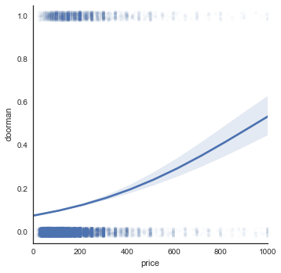


### Assessing where we are

* #### we have an idea of what features may be useful
 * in practice, we'd want to keep exploring some more


* #### we have an idea of a dependent variable: price


## Module 11: forming our training/test sets

* #### earlier, we noticed an issue with prices -- number of bedrooms
 * we can cap the bedrooms/beds as number of guests included
 * feature engineering


```python
q = """
SELECT beds, guests_included, 
       CASE WHEN guests_included <= bedrooms THEN guests_included
         ELSE bedrooms END AS bedrooms_adj,
       CASE WHEN guests_included <= beds THEN guests_included
         ELSE beds END AS beds_adj
FROM listings
ORDER BY beds DESC
"""
query(q).dropna().head()
```


<div>
<table border="1" class="dataframe">
  <thead>
    <tr style="text-align: right;">
      <th></th>
      <th>beds</th>
      <th>guests_included</th>
      <th>bedrooms_adj</th>
      <th>beds_adj</th>
    </tr>
  </thead>
  <tbody>
    <tr>
      <th>86</th>
      <td>16</td>
      <td>16</td>
      <td>7</td>
      <td>16</td>
    </tr>
    <tr>
      <th>87</th>
      <td>16</td>
      <td>1</td>
      <td>1</td>
      <td>1</td>
    </tr>
    <tr>
      <th>88</th>
      <td>16</td>
      <td>1</td>
      <td>1</td>
      <td>1</td>
    </tr>
    <tr>
      <th>89</th>
      <td>16</td>
      <td>2</td>
      <td>2</td>
      <td>2</td>
    </tr>
    <tr>
      <th>90</th>
      <td>16</td>
      <td>16</td>
      <td>8</td>
      <td>16</td>
    </tr>
  </tbody>
</table>
</div>


#### back to our list of columns to keep


```python
print keepers
```

    ['room_type_category', 'bed_type_category', 'cancellation_policy', 'star_rating', 'bedrooms', 'bathrooms', 'beds', 'guests_included', 'person_capacity', 'property_type', 'min_nights_input_value', 'listing_price_for_extra_person_native', 'picture_count', 'neighborhood', 'listing_cleaning_fee_native', 'extras_price_native', 'listing_security_deposit_native', 'security_deposit_native', 'max_nights_input_value', 'reviews_count', 'listing_weekend_price_native', 'price', 'weekly_price_native']


### String manipulation is important, so let's whiteboard how to select
* #### only these columns
* #### excluding bedrooms, beds
* #### plus bedrooms_adj, beds_adj

#### starter:
```sql
SELECT CASE WHEN guests_included <= bedrooms THEN guests_included
            ELSE bedrooms END AS bedrooms_adj,
       CASE WHEN guests_included <= beds THEN guests_included
            ELSE beds END AS beds_adj
       , lid
```


```python
q = """SELECT CASE WHEN guests_included <= bedrooms THEN guests_included
    ELSE bedrooms END AS bedrooms_adj,
  CASE WHEN guests_included <= beds THEN guests_included
    ELSE beds END AS beds_adj
  , lid \n"""

q += '\n'.join([', {0}'.format(k) for k in keepers if k not in ['bedrooms', 'beds']])
q += '\n FROM listings'
query(q).head()
```


<div>
<table border="1" class="dataframe">
  <thead>
    <tr style="text-align: right;">
      <th></th>
      <th>bedrooms_adj</th>
      <th>beds_adj</th>
      <th>lid</th>
      <th>room_type_category</th>
      <th>bed_type_category</th>
      <th>cancellation_policy</th>
      <th>star_rating</th>
      <th>bathrooms</th>
      <th>guests_included</th>
      <th>person_capacity</th>
      <th>...</th>
      <th>neighborhood</th>
      <th>listing_cleaning_fee_native</th>
      <th>extras_price_native</th>
      <th>listing_security_deposit_native</th>
      <th>security_deposit_native</th>
      <th>max_nights_input_value</th>
      <th>reviews_count</th>
      <th>listing_weekend_price_native</th>
      <th>price</th>
      <th>weekly_price_native</th>
    </tr>
  </thead>
  <tbody>
    <tr>
      <th>0</th>
      <td>1</td>
      <td>2</td>
      <td>6029332</td>
      <td>private_room</td>
      <td>real_bed</td>
      <td>flexible</td>
      <td>5</td>
      <td>1.5</td>
      <td>2</td>
      <td>3</td>
      <td>...</td>
      <td>Williamsburg</td>
      <td>NaN</td>
      <td>NaN</td>
      <td>NaN</td>
      <td>NaN</td>
      <td>NaN</td>
      <td>4</td>
      <td>115</td>
      <td>110</td>
      <td>684</td>
    </tr>
    <tr>
      <th>1</th>
      <td>1</td>
      <td>1</td>
      <td>4325397</td>
      <td>private_room</td>
      <td>real_bed</td>
      <td>moderate</td>
      <td>NaN</td>
      <td>1.0</td>
      <td>1</td>
      <td>2</td>
      <td>...</td>
      <td>Astoria</td>
      <td>50</td>
      <td>50</td>
      <td>350</td>
      <td>350</td>
      <td>NaN</td>
      <td>1</td>
      <td>90</td>
      <td>75</td>
      <td>525</td>
    </tr>
    <tr>
      <th>2</th>
      <td>1</td>
      <td>1</td>
      <td>6422551</td>
      <td>private_room</td>
      <td>real_bed</td>
      <td>flexible</td>
      <td>NaN</td>
      <td>1.0</td>
      <td>1</td>
      <td>2</td>
      <td>...</td>
      <td>Williamsburg</td>
      <td>NaN</td>
      <td>NaN</td>
      <td>NaN</td>
      <td>NaN</td>
      <td>NaN</td>
      <td>NaN</td>
      <td>NaN</td>
      <td>75</td>
      <td>550</td>
    </tr>
    <tr>
      <th>3</th>
      <td>1</td>
      <td>1</td>
      <td>6684697</td>
      <td>private_room</td>
      <td>real_bed</td>
      <td>moderate</td>
      <td>5</td>
      <td>1.0</td>
      <td>2</td>
      <td>3</td>
      <td>...</td>
      <td>Williamsburg</td>
      <td>30</td>
      <td>30</td>
      <td>750</td>
      <td>750</td>
      <td>NaN</td>
      <td>7</td>
      <td>NaN</td>
      <td>145</td>
      <td>NaN</td>
    </tr>
    <tr>
      <th>4</th>
      <td>1</td>
      <td>2</td>
      <td>4587554</td>
      <td>private_room</td>
      <td>real_bed</td>
      <td>moderate</td>
      <td>5</td>
      <td>1.0</td>
      <td>2</td>
      <td>2</td>
      <td>...</td>
      <td>Maspeth</td>
      <td>NaN</td>
      <td>NaN</td>
      <td>NaN</td>
      <td>NaN</td>
      <td>20</td>
      <td>21</td>
      <td>NaN</td>
      <td>55</td>
      <td>350</td>
    </tr>
  </tbody>
</table>
<p>5 rows × 24 columns</p>
</div>


### Remember how to create table?

#### hint: the syntax is referred to as CTAS


```python
q2 = 'CREATE TABLE dev.x00010_listings_modified_all AS \n ' + q
```

#### we found that problematic neighborhood


```python
q2 += "\n WHERE neighborhood NOT LIKE 'Very%' \n DISTRIBUTED RANDOMLY"
```


```python
query('DROP TABLE IF EXISTS dev.x00010_listings_modified_all')
query(q2, False)
```

## 80/20 Train/Test split
* #### Simplest approach: append a random number Unif(0,1), and put >0.80 in test


```python
q = """
CREATE TEMPORARY TABLE training_split AS
SELECT lid, random() AS random
FROM dev.x00010_listings_modified_all"""
query(q, False)
```


```python
q = """
SELECT lid, random, 
  CASE WHEN random > 0.8 THEN 'test'
  ELSE 'train' END AS set_type
FROM training_split
"""
query(q).head()
```


<div>
<table border="1" class="dataframe">
  <thead>
    <tr style="text-align: right;">
      <th></th>
      <th>lid</th>
      <th>random</th>
      <th>set_type</th>
    </tr>
  </thead>
  <tbody>
    <tr>
      <th>0</th>
      <td>6029332</td>
      <td>0.745662</td>
      <td>train</td>
    </tr>
    <tr>
      <th>1</th>
      <td>4325397</td>
      <td>0.130880</td>
      <td>train</td>
    </tr>
    <tr>
      <th>2</th>
      <td>6422551</td>
      <td>0.045285</td>
      <td>train</td>
    </tr>
    <tr>
      <th>3</th>
      <td>6684697</td>
      <td>0.771927</td>
      <td>train</td>
    </tr>
    <tr>
      <th>4</th>
      <td>4587554</td>
      <td>0.274045</td>
      <td>train</td>
    </tr>
  </tbody>
</table>
</div>


```python
q = """
SELECT count(*)::float/(SELECT COUNT(*) FROM training_split)::float AS split,  
  CASE WHEN random > 0.8 THEN 'test'
  ELSE 'train' END AS set_type
FROM training_split
GROUP BY 2
"""
query(q)
```


<div>
<table border="1" class="dataframe">
  <thead>
    <tr style="text-align: right;">
      <th></th>
      <th>split</th>
      <th>set_type</th>
    </tr>
  </thead>
  <tbody>
    <tr>
      <th>0</th>
      <td>0.197203</td>
      <td>test</td>
    </tr>
    <tr>
      <th>1</th>
      <td>0.802797</td>
      <td>train</td>
    </tr>
  </tbody>
</table>
</div>


## Break

### Randomized block sampling in HAWQ for those interested
* #### whiteboard for motivation
* #### what if the training set has higher or lower average price?
* #### what if some of the independent variables are skewed
* #### why (in general) shouldn't we do this in PL/Python?
* #### note: this is ugly code, but I have re-used it many times

```sql
select setseed(0.444);

WITH randomID AS (
    -- First assign a random ID to all rows. This will give us a random order.
SELECT lid, beds_adj, bedrooms_adj, neighborhood,
  CASE WHEN price < summary.first_quartile THEN 1 
    WHEN price < summary.median THEN 2 
    WHEN price < summary.third_quartile THEN 3
    ELSE 4 END AS price_quartile
    , random() as random 
  FROM dev.x00010_listings_modified_all listings, dev.x00000_listings_summary summary
  GROUP BY 1, 2, 3, 4, 5),
countGroups AS (
  -- Now we add row numbers for each group. So each group will start at 1. We order 
  -- by the random column we generated in the previous expression, so you should get
  -- different results in each execution
  SELECT *, 
    ROW_NUMBER() OVER (PARTITION BY beds_adj, bedrooms_adj, neighborhood, price_quartile ORDER BY random) AS     rowcnt FROM randomID
)
-- Use the rowcnt as a propoertion of size of the block
SELECT *, rowcnt::float/(SELECT MAX(rowcnt) 
           FROM countGroups c2 
           WHERE c1.beds_adj = c2.beds_adj 
            AND c1.bedrooms_adj = c2.bedrooms_adj 
            AND c1.neighborhood = c2.neighborhood
            AND c1.price_quartile = c2.price_quartile
           )::float as prop
    FROM countGroups c1
```


```python
q = """SELECT lid, beds_adj, bedrooms_adj, neighborhood,
CASE WHEN price < summary.first_quartile THEN 1 
 WHEN price < summary.median THEN 2 
 WHEN price < summary.third_quartile THEN 3
 ELSE 4 END AS price_quartile
, random() as random 
FROM dev.x00010_listings_modified_all listings, dev.x00000_listings_summary summary"""
query(q).head()
```


<div>
<table border="1" class="dataframe">
  <thead>
    <tr style="text-align: right;">
      <th></th>
      <th>lid</th>
      <th>beds_adj</th>
      <th>bedrooms_adj</th>
      <th>neighborhood</th>
      <th>price_quartile</th>
      <th>random</th>
    </tr>
  </thead>
  <tbody>
    <tr>
      <th>0</th>
      <td>6029332</td>
      <td>2</td>
      <td>1</td>
      <td>Williamsburg</td>
      <td>2</td>
      <td>0.512322</td>
    </tr>
    <tr>
      <th>1</th>
      <td>4325397</td>
      <td>1</td>
      <td>1</td>
      <td>Astoria</td>
      <td>2</td>
      <td>0.729473</td>
    </tr>
    <tr>
      <th>2</th>
      <td>6422551</td>
      <td>1</td>
      <td>1</td>
      <td>Williamsburg</td>
      <td>2</td>
      <td>0.797854</td>
    </tr>
    <tr>
      <th>3</th>
      <td>6684697</td>
      <td>1</td>
      <td>1</td>
      <td>Williamsburg</td>
      <td>3</td>
      <td>0.920444</td>
    </tr>
    <tr>
      <th>4</th>
      <td>4587554</td>
      <td>2</td>
      <td>1</td>
      <td>Maspeth</td>
      <td>1</td>
      <td>0.503167</td>
    </tr>
  </tbody>
</table>
</div>


```python
q = """
WITH randomID AS (
    -- First assign a random ID to all rows. This will give us a random order.
SELECT lid, beds_adj, bedrooms_adj, neighborhood,
  CASE WHEN price < summary.first_quartile THEN 1 
    WHEN price < summary.median THEN 2 
    WHEN price < summary.third_quartile THEN 3
    ELSE 4 END AS price_quartile
    , random() as random 
  FROM dev.x00010_listings_modified_all listings, dev.x00000_listings_summary summary
  GROUP BY 1, 2, 3, 4, 5),
countGroups AS (
  -- Now we add row numbers for each group. So each group will start at 1. We order 
  -- by the random column we generated in the previous expression, so you should get
  -- different results in each execution
  SELECT *, ROW_NUMBER() OVER (PARTITION BY beds_adj, bedrooms_adj, neighborhood, price_quartile ORDER BY random) AS     rowcnt FROM randomID
)
SELECT * from countGroups"""
query(q).head()
```


<div>
<table border="1" class="dataframe">
  <thead>
    <tr style="text-align: right;">
      <th></th>
      <th>lid</th>
      <th>beds_adj</th>
      <th>bedrooms_adj</th>
      <th>neighborhood</th>
      <th>price_quartile</th>
      <th>random</th>
      <th>rowcnt</th>
    </tr>
  </thead>
  <tbody>
    <tr>
      <th>0</th>
      <td>6589851</td>
      <td>1</td>
      <td>1</td>
      <td>Alphabet City</td>
      <td>1</td>
      <td>0.006135</td>
      <td>1</td>
    </tr>
    <tr>
      <th>1</th>
      <td>9115146</td>
      <td>1</td>
      <td>1</td>
      <td>Alphabet City</td>
      <td>1</td>
      <td>0.013195</td>
      <td>2</td>
    </tr>
    <tr>
      <th>2</th>
      <td>2207684</td>
      <td>1</td>
      <td>1</td>
      <td>Alphabet City</td>
      <td>1</td>
      <td>0.014403</td>
      <td>3</td>
    </tr>
    <tr>
      <th>3</th>
      <td>8522756</td>
      <td>1</td>
      <td>1</td>
      <td>Alphabet City</td>
      <td>1</td>
      <td>0.058219</td>
      <td>4</td>
    </tr>
    <tr>
      <th>4</th>
      <td>4621510</td>
      <td>1</td>
      <td>1</td>
      <td>Alphabet City</td>
      <td>1</td>
      <td>0.061482</td>
      <td>5</td>
    </tr>
  </tbody>
</table>
</div>


```python
q = """
WITH randomID AS (
    -- First assign a random ID to all rows. This will give us a random order.
SELECT lid, beds_adj, bedrooms_adj, neighborhood,
  CASE WHEN price < summary.first_quartile THEN 1 
    WHEN price < summary.median THEN 2 
    WHEN price < summary.third_quartile THEN 3
    ELSE 4 END AS price_quartile
    , random() as random 
  FROM dev.x00010_listings_modified_all listings, dev.x00000_listings_summary summary
  GROUP BY 1, 2, 3, 4, 5),
countGroups AS (
  -- Now we add row numbers for each group. So each group will start at 1. We order 
  -- by the random column we generated in the previous expression, so you should get
  -- different results in each execution
  SELECT *, 
    ROW_NUMBER() OVER (PARTITION BY beds_adj, bedrooms_adj, neighborhood, price_quartile ORDER BY random) AS     rowcnt FROM randomID
)
-- Now we get the data
SELECT lid, beds_adj, bedrooms_adj, neighborhood, price_quartile, rowcnt::float/(SELECT MAX(rowcnt) 
           FROM countGroups c2 
           WHERE c1.beds_adj = c2.beds_adj 
            AND c1.bedrooms_adj = c2.bedrooms_adj 
            AND c1.neighborhood = c2.neighborhood
            AND c1.price_quartile = c2.price_quartile
           )::float as prop
    FROM countGroups c1
"""
query(q).head()
```


<div>
<table border="1" class="dataframe">
  <thead>
    <tr style="text-align: right;">
      <th></th>
      <th>lid</th>
      <th>beds_adj</th>
      <th>bedrooms_adj</th>
      <th>neighborhood</th>
      <th>price_quartile</th>
      <th>prop</th>
    </tr>
  </thead>
  <tbody>
    <tr>
      <th>0</th>
      <td>5875665</td>
      <td>1</td>
      <td>1</td>
      <td>Alphabet City</td>
      <td>1</td>
      <td>0.016949</td>
    </tr>
    <tr>
      <th>1</th>
      <td>9820483</td>
      <td>1</td>
      <td>1</td>
      <td>Alphabet City</td>
      <td>1</td>
      <td>0.033898</td>
    </tr>
    <tr>
      <th>2</th>
      <td>9505654</td>
      <td>1</td>
      <td>1</td>
      <td>Alphabet City</td>
      <td>1</td>
      <td>0.050847</td>
    </tr>
    <tr>
      <th>3</th>
      <td>7065748</td>
      <td>1</td>
      <td>1</td>
      <td>Alphabet City</td>
      <td>1</td>
      <td>0.067797</td>
    </tr>
    <tr>
      <th>4</th>
      <td>8889664</td>
      <td>1</td>
      <td>1</td>
      <td>Alphabet City</td>
      <td>1</td>
      <td>0.084746</td>
    </tr>
  </tbody>
</table>
</div>


```python
query('CREATE OR REPLACE VIEW dev.x00011_stratified AS ({0})'.format(q), False)
```

### Now we can do any sort of split:
* #### test/train split
* #### test/train/cross-validation split
* #### k-fold cross-validation

#### Choose 60/20/20 Train/CV/Test


```python
query("""
CREATE OR REPLACE VIEW dev.x00012_set_type AS 
SELECT *,
 CASE WHEN prop < 0.2 THEN 'test'
  WHEN prop < 0.4 THEN 'cv'
  ELSE 'train' END AS set_type
FROM dev.x00011_stratified
""", False)
```

### Test the split


```python
query("""
SELECT d.beds_adj, d.bedrooms_adj, d.neighborhood, d.price_quartile, d.set_type, 
       count(*)::float/counts.tot::float as prop 
FROM dev.x00012_set_type d,
  (SELECT beds_adj, bedrooms_adj, neighborhood, price_quartile, count(*) as tot
    FROM dev.x00012_set_type
    GROUP BY 1, 2, 3, 4) counts
WHERE counts.beds_adj=d.beds_adj
   AND counts.bedrooms_adj=d.bedrooms_adj
   AND counts.neighborhood=d.neighborhood
   AND counts.price_quartile=d.price_quartile
GROUP BY 1, 2, 3, 4, 5, counts.tot
ORDER BY 1, 2, 3, 4, 5
""").head(25)
```


<div>
<table border="1" class="dataframe">
  <thead>
    <tr style="text-align: right;">
      <th></th>
      <th>beds_adj</th>
      <th>bedrooms_adj</th>
      <th>neighborhood</th>
      <th>price_quartile</th>
      <th>set_type</th>
      <th>prop</th>
    </tr>
  </thead>
  <tbody>
    <tr>
      <th>0</th>
      <td>1</td>
      <td>1</td>
      <td>Alphabet City</td>
      <td>1</td>
      <td>cv</td>
      <td>0.203390</td>
    </tr>
    <tr>
      <th>1</th>
      <td>1</td>
      <td>1</td>
      <td>Alphabet City</td>
      <td>1</td>
      <td>test</td>
      <td>0.186441</td>
    </tr>
    <tr>
      <th>2</th>
      <td>1</td>
      <td>1</td>
      <td>Alphabet City</td>
      <td>1</td>
      <td>train</td>
      <td>0.610169</td>
    </tr>
    <tr>
      <th>3</th>
      <td>1</td>
      <td>1</td>
      <td>Alphabet City</td>
      <td>2</td>
      <td>cv</td>
      <td>0.201923</td>
    </tr>
    <tr>
      <th>4</th>
      <td>1</td>
      <td>1</td>
      <td>Alphabet City</td>
      <td>2</td>
      <td>test</td>
      <td>0.197115</td>
    </tr>
    <tr>
      <th>5</th>
      <td>1</td>
      <td>1</td>
      <td>Alphabet City</td>
      <td>2</td>
      <td>train</td>
      <td>0.600962</td>
    </tr>
    <tr>
      <th>6</th>
      <td>1</td>
      <td>1</td>
      <td>Alphabet City</td>
      <td>3</td>
      <td>cv</td>
      <td>0.198953</td>
    </tr>
    <tr>
      <th>7</th>
      <td>1</td>
      <td>1</td>
      <td>Alphabet City</td>
      <td>3</td>
      <td>test</td>
      <td>0.198953</td>
    </tr>
    <tr>
      <th>8</th>
      <td>1</td>
      <td>1</td>
      <td>Alphabet City</td>
      <td>3</td>
      <td>train</td>
      <td>0.602094</td>
    </tr>
    <tr>
      <th>9</th>
      <td>1</td>
      <td>1</td>
      <td>Alphabet City</td>
      <td>4</td>
      <td>cv</td>
      <td>0.197279</td>
    </tr>
    <tr>
      <th>10</th>
      <td>1</td>
      <td>1</td>
      <td>Alphabet City</td>
      <td>4</td>
      <td>test</td>
      <td>0.197279</td>
    </tr>
    <tr>
      <th>11</th>
      <td>1</td>
      <td>1</td>
      <td>Alphabet City</td>
      <td>4</td>
      <td>train</td>
      <td>0.605442</td>
    </tr>
    <tr>
      <th>12</th>
      <td>1</td>
      <td>1</td>
      <td>Astoria</td>
      <td>1</td>
      <td>cv</td>
      <td>0.200000</td>
    </tr>
    <tr>
      <th>13</th>
      <td>1</td>
      <td>1</td>
      <td>Astoria</td>
      <td>1</td>
      <td>test</td>
      <td>0.196721</td>
    </tr>
    <tr>
      <th>14</th>
      <td>1</td>
      <td>1</td>
      <td>Astoria</td>
      <td>1</td>
      <td>train</td>
      <td>0.603279</td>
    </tr>
    <tr>
      <th>15</th>
      <td>1</td>
      <td>1</td>
      <td>Astoria</td>
      <td>2</td>
      <td>cv</td>
      <td>0.197861</td>
    </tr>
    <tr>
      <th>16</th>
      <td>1</td>
      <td>1</td>
      <td>Astoria</td>
      <td>2</td>
      <td>test</td>
      <td>0.197861</td>
    </tr>
    <tr>
      <th>17</th>
      <td>1</td>
      <td>1</td>
      <td>Astoria</td>
      <td>2</td>
      <td>train</td>
      <td>0.604278</td>
    </tr>
    <tr>
      <th>18</th>
      <td>1</td>
      <td>1</td>
      <td>Astoria</td>
      <td>3</td>
      <td>cv</td>
      <td>0.203540</td>
    </tr>
    <tr>
      <th>19</th>
      <td>1</td>
      <td>1</td>
      <td>Astoria</td>
      <td>3</td>
      <td>test</td>
      <td>0.194690</td>
    </tr>
    <tr>
      <th>20</th>
      <td>1</td>
      <td>1</td>
      <td>Astoria</td>
      <td>3</td>
      <td>train</td>
      <td>0.601770</td>
    </tr>
    <tr>
      <th>21</th>
      <td>1</td>
      <td>1</td>
      <td>Astoria</td>
      <td>4</td>
      <td>cv</td>
      <td>0.181818</td>
    </tr>
    <tr>
      <th>22</th>
      <td>1</td>
      <td>1</td>
      <td>Astoria</td>
      <td>4</td>
      <td>test</td>
      <td>0.181818</td>
    </tr>
    <tr>
      <th>23</th>
      <td>1</td>
      <td>1</td>
      <td>Astoria</td>
      <td>4</td>
      <td>train</td>
      <td>0.636364</td>
    </tr>
    <tr>
      <th>24</th>
      <td>1</td>
      <td>1</td>
      <td>Battery Park City</td>
      <td>1</td>
      <td>cv</td>
      <td>0.333333</td>
    </tr>
  </tbody>
</table>
</div>


### It's a good time to clean up the dataset (using manual inspection)


```python
### prepare this to be a dummy variable
q = """
CREATE OR REPLACE FUNCTION clean_categorical(n text)
    RETURNS text
AS
$$  
    if not n:
      return 'NA'
    return n.replace(' ','_')\
            .replace('-','_')\
            .replace('/','_')\
            .replace("'",'')\
            .replace('(','')\
            .replace(')','')\
            .replace('.','')\
            .replace('&','')\
            .lower()
$$ 
LANGUAGE PLPYTHONU;
"""
query(q, False)
```


```python
q="""
CREATE OR REPLACE VIEW dev.x00013_listings_all_cleaned AS
SELECT lid, bedrooms_adj, beds_adj, room_type_category, 
   bed_type_category, bathrooms, guests_included, 
   clean_categorical(property_type) as property_type
   , CASE WHEN min_nights_input_value IS NULL THEN 0 ELSE min_nights_input_value END AS min_nights
   , CASE WHEN picture_count IS NULL THEN 0 ELSE picture_count END AS picture_count
   , CASE WHEN reviews_count IS NULL THEN 0 ELSE reviews_count END AS reviews_count
   , clean_categorical(neighborhood) as neighborhood
   , CASE WHEN extras_price_native IS NULL THEN 0 
       ELSE extras_price_native END AS extras
   , CASE WHEN listing_weekend_price_native IS NULL THEN price
       ELSE listing_weekend_price_native END as price
FROM  dev.x00010_listings_modified_all
"""
query(q, False)
```

## Module 12: categorical variables
* #### we'll need to create dummy variables
* #### http://doc.madlib.net/master/group__grp__data__prep.html
* #### quickly gloss over the next few slides


```python
df = query('SELECT * FROM dev.x00013_listings_all_cleaned LIMIT 2')
df
```


<div>
<table border="1" class="dataframe">
  <thead>
    <tr style="text-align: right;">
      <th></th>
      <th>lid</th>
      <th>bedrooms_adj</th>
      <th>beds_adj</th>
      <th>room_type_category</th>
      <th>bed_type_category</th>
      <th>bathrooms</th>
      <th>guests_included</th>
      <th>property_type</th>
      <th>min_nights</th>
      <th>picture_count</th>
      <th>reviews_count</th>
      <th>neighborhood</th>
      <th>extras</th>
      <th>price</th>
    </tr>
  </thead>
  <tbody>
    <tr>
      <th>0</th>
      <td>6029332</td>
      <td>1</td>
      <td>2</td>
      <td>private_room</td>
      <td>real_bed</td>
      <td>1.5</td>
      <td>2</td>
      <td>apartment</td>
      <td>2</td>
      <td>15</td>
      <td>4</td>
      <td>williamsburg</td>
      <td>0</td>
      <td>115</td>
    </tr>
    <tr>
      <th>1</th>
      <td>4325397</td>
      <td>1</td>
      <td>1</td>
      <td>private_room</td>
      <td>real_bed</td>
      <td>1.0</td>
      <td>1</td>
      <td>apartment</td>
      <td>2</td>
      <td>3</td>
      <td>1</td>
      <td>astoria</td>
      <td>50</td>
      <td>90</td>
    </tr>
  </tbody>
</table>
</div>


```python
query('DROP TABLE IF EXISTS dev.x00014_categorical_cleaned CASCADE')
categorical = ['room_type_category', 'bed_type_category', 'property_type', 'neighborhood']
q = 'CREATE TABLE dev.x00014_categorical_cleaned AS \n SELECT lid \n' 
q += '\n'.join([', {0}'.format(c) for c in categorical])
q += '\n FROM dev.x00013_listings_all_cleaned DISTRIBUTED RANDOMLY'
query(q, False)
```


```python
non_categorical = [c for c in df.columns if c not in categorical]
q = 'CREATE OR REPLACE VIEW dev.x00015_non_categorical_cleaned AS \n SELECT lid \n' 
q += '\n'.join([', {0}'.format(c) for c in non_categorical])[2:]
q += '\n FROM dev.x00013_listings_all_cleaned'
query(q, False)
```

### Keeping stock:
* #### dev.x00010_amenities_table has the amenities columns
* #### dev.x00012_set_type has the set type (train, cv, test)
* #### dev.x00014_categorical_cleaned has the categorical values
* #### dev.x00015_non_categorical_cleaned has the non-categorical values
* #### all can be joined on lid

### Use MADlib to create dummy variables


```python
q =["""DROP TABLE IF EXISTS dev.tmp1""",
    
"""
SELECT madlib.create_indicator_variables 
      ('dev.x00014_categorical_cleaned', 
      'dev.tmp1', 
      'bed_type_category')""",
"""
SELECT * 
FROM dev.tmp1
LIMIT 5
"""]
query(q)
```


<div>
<table border="1" class="dataframe">
  <thead>
    <tr style="text-align: right;">
      <th></th>
      <th>lid</th>
      <th>room_type_category</th>
      <th>bed_type_category</th>
      <th>property_type</th>
      <th>neighborhood</th>
      <th>bed_type_category_airbed</th>
      <th>bed_type_category_couch</th>
      <th>bed_type_category_futon</th>
      <th>bed_type_category_pull_out_sofa</th>
      <th>bed_type_category_real_bed</th>
    </tr>
  </thead>
  <tbody>
    <tr>
      <th>0</th>
      <td>6029332</td>
      <td>private_room</td>
      <td>real_bed</td>
      <td>apartment</td>
      <td>williamsburg</td>
      <td>0</td>
      <td>0</td>
      <td>0</td>
      <td>0</td>
      <td>1</td>
    </tr>
    <tr>
      <th>1</th>
      <td>4325397</td>
      <td>private_room</td>
      <td>real_bed</td>
      <td>apartment</td>
      <td>astoria</td>
      <td>0</td>
      <td>0</td>
      <td>0</td>
      <td>0</td>
      <td>1</td>
    </tr>
    <tr>
      <th>2</th>
      <td>6422551</td>
      <td>private_room</td>
      <td>real_bed</td>
      <td>apartment</td>
      <td>williamsburg</td>
      <td>0</td>
      <td>0</td>
      <td>0</td>
      <td>0</td>
      <td>1</td>
    </tr>
    <tr>
      <th>3</th>
      <td>6684697</td>
      <td>private_room</td>
      <td>real_bed</td>
      <td>apartment</td>
      <td>williamsburg</td>
      <td>0</td>
      <td>0</td>
      <td>0</td>
      <td>0</td>
      <td>1</td>
    </tr>
    <tr>
      <th>4</th>
      <td>4587554</td>
      <td>private_room</td>
      <td>real_bed</td>
      <td>house</td>
      <td>maspeth</td>
      <td>0</td>
      <td>0</td>
      <td>0</td>
      <td>0</td>
      <td>1</td>
    </tr>
  </tbody>
</table>
</div>


### We can use simple string manipulations keep creating new tables based on the previous table


```python
old_table = 'dev.x00014_categorical_cleaned'
for i, c in enumerate(categorical):
    new_table = 'dev.tmp{0}'.format(i)
    q = """
    SELECT madlib.create_indicator_variables 
          ('{0}', 
          '{1}', 
          '{2}')""".format(old_table, new_table, c)
    old_table = new_table
    print q
```

    
        SELECT madlib.create_indicator_variables 
              ('dev.x00014_categorical_cleaned', 
              'dev.tmp0', 
              'room_type_category')
    
        SELECT madlib.create_indicator_variables 
              ('dev.tmp0', 
              'dev.tmp1', 
              'bed_type_category')
    
        SELECT madlib.create_indicator_variables 
              ('dev.tmp1', 
              'dev.tmp2', 
              'property_type')
    
        SELECT madlib.create_indicator_variables 
              ('dev.tmp2', 
              'dev.tmp3', 
              'neighborhood')


```python
old_table = 'dev.x00014_categorical_cleaned'
for i, c in enumerate(categorical):
    new_table = 'dev.tmp{0}'.format(i)
    query('DROP TABLE IF EXISTS {0} CASCADE'.format(new_table))    
    q = """
    SELECT madlib.create_indicator_variables 
          ('{0}', 
          '{1}', 
          '{2}')""".format(old_table, new_table, c)
    old_table = new_table
    query(q)
```


```python
df = query('SELECT * FROM dev.tmp3 LIMIT 5')
df.head()
```


<div>
<table border="1" class="dataframe">
  <thead>
    <tr style="text-align: right;">
      <th></th>
      <th>lid</th>
      <th>room_type_category</th>
      <th>bed_type_category</th>
      <th>property_type</th>
      <th>neighborhood</th>
      <th>room_type_category_entire_home</th>
      <th>room_type_category_private_room</th>
      <th>room_type_category_shared_room</th>
      <th>bed_type_category_airbed</th>
      <th>bed_type_category_couch</th>
      <th>...</th>
      <th>neighborhood_wakefield</th>
      <th>neighborhood_washington_heights</th>
      <th>neighborhood_west_brighton</th>
      <th>neighborhood_west_village</th>
      <th>neighborhood_williamsbridge</th>
      <th>neighborhood_williamsburg</th>
      <th>neighborhood_windsor_terrace</th>
      <th>neighborhood_woodhaven</th>
      <th>neighborhood_woodside</th>
      <th>neighborhood_yorkville</th>
    </tr>
  </thead>
  <tbody>
    <tr>
      <th>0</th>
      <td>6029332</td>
      <td>private_room</td>
      <td>real_bed</td>
      <td>apartment</td>
      <td>williamsburg</td>
      <td>0</td>
      <td>1</td>
      <td>0</td>
      <td>0</td>
      <td>0</td>
      <td>...</td>
      <td>0</td>
      <td>0</td>
      <td>0</td>
      <td>0</td>
      <td>0</td>
      <td>1</td>
      <td>0</td>
      <td>0</td>
      <td>0</td>
      <td>0</td>
    </tr>
    <tr>
      <th>1</th>
      <td>4325397</td>
      <td>private_room</td>
      <td>real_bed</td>
      <td>apartment</td>
      <td>astoria</td>
      <td>0</td>
      <td>1</td>
      <td>0</td>
      <td>0</td>
      <td>0</td>
      <td>...</td>
      <td>0</td>
      <td>0</td>
      <td>0</td>
      <td>0</td>
      <td>0</td>
      <td>0</td>
      <td>0</td>
      <td>0</td>
      <td>0</td>
      <td>0</td>
    </tr>
    <tr>
      <th>2</th>
      <td>6422551</td>
      <td>private_room</td>
      <td>real_bed</td>
      <td>apartment</td>
      <td>williamsburg</td>
      <td>0</td>
      <td>1</td>
      <td>0</td>
      <td>0</td>
      <td>0</td>
      <td>...</td>
      <td>0</td>
      <td>0</td>
      <td>0</td>
      <td>0</td>
      <td>0</td>
      <td>1</td>
      <td>0</td>
      <td>0</td>
      <td>0</td>
      <td>0</td>
    </tr>
    <tr>
      <th>3</th>
      <td>6684697</td>
      <td>private_room</td>
      <td>real_bed</td>
      <td>apartment</td>
      <td>williamsburg</td>
      <td>0</td>
      <td>1</td>
      <td>0</td>
      <td>0</td>
      <td>0</td>
      <td>...</td>
      <td>0</td>
      <td>0</td>
      <td>0</td>
      <td>0</td>
      <td>0</td>
      <td>1</td>
      <td>0</td>
      <td>0</td>
      <td>0</td>
      <td>0</td>
    </tr>
    <tr>
      <th>4</th>
      <td>4587554</td>
      <td>private_room</td>
      <td>real_bed</td>
      <td>house</td>
      <td>maspeth</td>
      <td>0</td>
      <td>1</td>
      <td>0</td>
      <td>0</td>
      <td>0</td>
      <td>...</td>
      <td>0</td>
      <td>0</td>
      <td>0</td>
      <td>0</td>
      <td>0</td>
      <td>0</td>
      <td>0</td>
      <td>0</td>
      <td>0</td>
      <td>0</td>
    </tr>
  </tbody>
</table>
<p>5 rows × 174 columns</p>
</div>


```python
q = 'SELECT '
q += '\n'.join([', {0} '.format(c) for c in df.columns if c not in categorical and c.lower() != 'property_type_na'])[2:]
q += 'FROM dev.tmp3 LIMIT 5'
query(q)
```


<div>
<table border="1" class="dataframe">
  <thead>
    <tr style="text-align: right;">
      <th></th>
      <th>lid</th>
      <th>room_type_category_entire_home</th>
      <th>room_type_category_private_room</th>
      <th>room_type_category_shared_room</th>
      <th>bed_type_category_airbed</th>
      <th>bed_type_category_couch</th>
      <th>bed_type_category_futon</th>
      <th>bed_type_category_pull_out_sofa</th>
      <th>bed_type_category_real_bed</th>
      <th>property_type_apartment</th>
      <th>...</th>
      <th>neighborhood_wakefield</th>
      <th>neighborhood_washington_heights</th>
      <th>neighborhood_west_brighton</th>
      <th>neighborhood_west_village</th>
      <th>neighborhood_williamsbridge</th>
      <th>neighborhood_williamsburg</th>
      <th>neighborhood_windsor_terrace</th>
      <th>neighborhood_woodhaven</th>
      <th>neighborhood_woodside</th>
      <th>neighborhood_yorkville</th>
    </tr>
  </thead>
  <tbody>
    <tr>
      <th>0</th>
      <td>6029332</td>
      <td>0</td>
      <td>1</td>
      <td>0</td>
      <td>0</td>
      <td>0</td>
      <td>0</td>
      <td>0</td>
      <td>1</td>
      <td>1</td>
      <td>...</td>
      <td>0</td>
      <td>0</td>
      <td>0</td>
      <td>0</td>
      <td>0</td>
      <td>1</td>
      <td>0</td>
      <td>0</td>
      <td>0</td>
      <td>0</td>
    </tr>
    <tr>
      <th>1</th>
      <td>4325397</td>
      <td>0</td>
      <td>1</td>
      <td>0</td>
      <td>0</td>
      <td>0</td>
      <td>0</td>
      <td>0</td>
      <td>1</td>
      <td>1</td>
      <td>...</td>
      <td>0</td>
      <td>0</td>
      <td>0</td>
      <td>0</td>
      <td>0</td>
      <td>0</td>
      <td>0</td>
      <td>0</td>
      <td>0</td>
      <td>0</td>
    </tr>
    <tr>
      <th>2</th>
      <td>6422551</td>
      <td>0</td>
      <td>1</td>
      <td>0</td>
      <td>0</td>
      <td>0</td>
      <td>0</td>
      <td>0</td>
      <td>1</td>
      <td>1</td>
      <td>...</td>
      <td>0</td>
      <td>0</td>
      <td>0</td>
      <td>0</td>
      <td>0</td>
      <td>1</td>
      <td>0</td>
      <td>0</td>
      <td>0</td>
      <td>0</td>
    </tr>
    <tr>
      <th>3</th>
      <td>6684697</td>
      <td>0</td>
      <td>1</td>
      <td>0</td>
      <td>0</td>
      <td>0</td>
      <td>0</td>
      <td>0</td>
      <td>1</td>
      <td>1</td>
      <td>...</td>
      <td>0</td>
      <td>0</td>
      <td>0</td>
      <td>0</td>
      <td>0</td>
      <td>1</td>
      <td>0</td>
      <td>0</td>
      <td>0</td>
      <td>0</td>
    </tr>
    <tr>
      <th>4</th>
      <td>4587554</td>
      <td>0</td>
      <td>1</td>
      <td>0</td>
      <td>0</td>
      <td>0</td>
      <td>0</td>
      <td>0</td>
      <td>1</td>
      <td>0</td>
      <td>...</td>
      <td>0</td>
      <td>0</td>
      <td>0</td>
      <td>0</td>
      <td>0</td>
      <td>0</td>
      <td>0</td>
      <td>0</td>
      <td>0</td>
      <td>0</td>
    </tr>
  </tbody>
</table>
<p>5 rows × 169 columns</p>
</div>


```python
q = 'CREATE TABLE dev.x00016_categorical_dummy AS SELECT '
q += '\n'.join([', {0} '.format(c) for c in df.columns \
                if c not in categorical and c.lower() != 'property_type_na'])[2:]
q += 'FROM dev.tmp3 DISTRIBUTED RANDOMLY'

query(q)
```


    psycopg2.ProgrammingError('no results to fetch')


```python
df = query('SELECT * FROM dev.tmp2')
categorical_n = [c for c in categorical if c != 'neighborhood']
q = 'CREATE TABLE dev.x00017_categorical_dummy_excl_hood AS SELECT '
q += '\n'.join([', {0} '.format(c) for c in df.columns \
                if c not in categorical_n and c.lower() != 'property_type_na'])[2:]
q += 'FROM dev.tmp2 DISTRIBUTED RANDOMLY'

query(q)
```


    psycopg2.ProgrammingError('no results to fetch')


### Keeping stock:
* #### dev.x00010_amenities_table has the amenities columns
* #### dev.x00012_set_type has the set type (train, cv, test)
* #### dev.x00017_categorical_dummy_excl_hood has the categorical values excluding neighborhood
 * #### partial pooling vs. no pooling vs. hierarchical
* #### dev.x00016_categorical_dummy has the categorical values
* #### dev.x00015_non_categorical_cleaned has the non-categorical values

### all can be joined on lid


```python
df = query("""SELECT s_lid, a.*, n.*, c.*
    FROM dev.x00010_amenities_table a
      , (select lid as s_lid, set_type from dev.x00012_set_type) s
      , dev.x00015_non_categorical_cleaned n
      , dev.x00016_categorical_dummy c
    WHERE a.lid = s.s_lid and a.lid = n.lid and a.lid = c.lid
        and s.s_lid = n.lid and s.s_lid = c.lid and n.lid = c.lid
        and s.set_type = 'train'
    LIMIT 1
    """)
```


```python
len(df.columns)
```


    222


### Python to the rescue: rather than enumerating 218 out of 222 columns:
* #### select all columns from a quick query
* #### skip the redundant lid columns (the cause of pain in this case)


```python
all_cols = [c for c in set(df.columns) if c not in ['lid','s_lid']]
all_cols = 's_lid as lid \n' + '\n'.join(sorted([', {0} '.format(c) for c in all_cols]))
```


```python
len([c for c in set(df.columns) if c not in ['lid','s_lid']])
```


    218


```python
for i, set_type in enumerate(['train','test','cv']):
    q = """CREATE TABLE dev.x0010{0}_{1}_set AS
    SELECT {2}
        FROM dev.x00010_amenities_table a
          , (select lid as s_lid, set_type from dev.x00012_set_type) s
          , dev.x00015_non_categorical_cleaned n
          , dev.x00016_categorical_dummy c
        WHERE a.lid = s.s_lid and a.lid = n.lid and a.lid = c.lid
            and s.s_lid = n.lid and s.s_lid = c.lid and n.lid = c.lid
            and s.set_type = '{1}'
    DISTRIBUTED RANDOMLY
    """.format(i, set_type, all_cols)
    query(q)
```

## Module 13: Training Models in MADlib

### From the website for Multiple Regression using OLS:
```sql
linregr_train( source_table,
               out_table,
               dependent_varname,
               independent_varname,
               grouping_cols,
               heteroskedasticity_option
             )

SELECT madlib.linregr_train( 'houses',
                             'houses_linregr_bedroom',
                             'price',
                             'ARRAY[1, tax, bath, size]',
                             'bedroom'
                           );

```
http://doc.madlib.net/latest/group__grp__linreg.html

### Columns:
* #### s_lid is the unique identifier
* #### price is the label
* #### everything else is a feature


```python
df = query('SELECT * FROM dev.x00100_train_set LIMIT 1')
df.head()
```


<div>
<table border="1" class="dataframe">
  <thead>
    <tr style="text-align: right;">
      <th></th>
      <th>lid</th>
      <th>air_conditioning</th>
      <th>bathrooms</th>
      <th>bed_type_category_airbed</th>
      <th>bed_type_category_couch</th>
      <th>bed_type_category_futon</th>
      <th>bed_type_category_pull_out_sofa</th>
      <th>bed_type_category_real_bed</th>
      <th>bedrooms_adj</th>
      <th>beds_adj</th>
      <th>...</th>
      <th>shampoo</th>
      <th>smoke_detector</th>
      <th>smoking_allowed</th>
      <th>suitable_for_events</th>
      <th>tv</th>
      <th>washer</th>
      <th>washer___dryer</th>
      <th>wheelchair_accessible</th>
      <th>wireless_internet</th>
      <th>x24_hour_check_in</th>
    </tr>
  </thead>
  <tbody>
    <tr>
      <th>0</th>
      <td>4325397</td>
      <td>1</td>
      <td>1</td>
      <td>0</td>
      <td>0</td>
      <td>0</td>
      <td>0</td>
      <td>1</td>
      <td>1</td>
      <td>1</td>
      <td>...</td>
      <td>1</td>
      <td>1</td>
      <td>0</td>
      <td>0</td>
      <td>0</td>
      <td>0</td>
      <td>0</td>
      <td>0</td>
      <td>1</td>
      <td>0</td>
    </tr>
  </tbody>
</table>
<p>1 rows × 219 columns</p>
</div>


```python
cols = str(sorted([c for c in df.columns if c not in ['lid', 's_lid','price']]))
features = 'ARRAY[1, ' + cols.replace("'",'')[1:]
```


```python
query('DROP TABLE IF EXISTS dev.x01000_linreg')
query('DROP TABLE IF EXISTS dev.x01000_linreg_summary')
```


    psycopg2.ProgrammingError('no results to fetch')


```python
%%time
q = """
SELECT madlib.linregr_train('dev.x00100_train_set',
         'dev.x01000_linreg',
         'price',
         '{0}'
       )""".format(features)
query(q)
```

    CPU times: user 1.39 ms, sys: 638 µs, total: 2.03 ms
    Wall time: 7.73 s


### In-database analytics:


```python
query('SELECT * FROM dev.x01000_linreg')
```


<div>
<table border="1" class="dataframe">
  <thead>
    <tr style="text-align: right;">
      <th></th>
      <th>coef</th>
      <th>r2</th>
      <th>std_err</th>
      <th>t_stats</th>
      <th>p_values</th>
      <th>condition_no</th>
      <th>num_rows_processed</th>
      <th>num_missing_rows_skipped</th>
      <th>variance_covariance</th>
    </tr>
  </thead>
  <tbody>
    <tr>
      <th>0</th>
      <td>[4.11869024858, 3.91426072878, 6.12351027505, ...</td>
      <td>0.163733</td>
      <td>[0.10495838693, 0.0996612502446, 0.15618172999...</td>
      <td>[39.2411732787, 39.2756534678, 39.2075966575, ...</td>
      <td>[4.49599737716e-322, 1.28457067919e-322, 1.506...</td>
      <td>inf</td>
      <td>16707</td>
      <td>3133</td>
      <td>[[0.011016262987, 0.0104574923312, 0.016378665...</td>
    </tr>
  </tbody>
</table>
</div>


### We can inspect and plot the coefficients


```python
feats = "ARRAY['intercept', " + cols[1:]
q = """
SELECT unnest({0}) as feature, unnest(coef) as coef, unnest(std_err) as std_err
FROM dev.x01000_linreg
""".format(feats)
coefs = query(q)
```


```python
coefs.sort_values(by='coef', ascending = False, inplace = True)
coefs.head()
```


<div>
<table border="1" class="dataframe">
  <thead>
    <tr style="text-align: right;">
      <th></th>
      <th>feature</th>
      <th>coef</th>
      <th>std_err</th>
    </tr>
  </thead>
  <tbody>
    <tr>
      <th>25</th>
      <td>guests_included</td>
      <td>22.735704</td>
      <td>0.584536</td>
    </tr>
    <tr>
      <th>9</th>
      <td>beds_adj</td>
      <td>15.499219</td>
      <td>0.398035</td>
    </tr>
    <tr>
      <th>8</th>
      <td>bedrooms_adj</td>
      <td>10.588139</td>
      <td>0.271328</td>
    </tr>
    <tr>
      <th>2</th>
      <td>bathrooms</td>
      <td>6.123510</td>
      <td>0.156182</td>
    </tr>
    <tr>
      <th>34</th>
      <td>kitchen</td>
      <td>4.155322</td>
      <td>0.105892</td>
    </tr>
  </tbody>
</table>
</div>


```python
coefs.tail()
```


<div>
<table border="1" class="dataframe">
  <thead>
    <tr style="text-align: right;">
      <th></th>
      <th>feature</th>
      <th>coef</th>
      <th>std_err</th>
    </tr>
  </thead>
  <tbody>
    <tr>
      <th>37</th>
      <td>lock_on_bedroom_door</td>
      <td>-0.156042</td>
      <td>0.004057</td>
    </tr>
    <tr>
      <th>28</th>
      <td>hangers</td>
      <td>-0.195198</td>
      <td>0.005153</td>
    </tr>
    <tr>
      <th>27</th>
      <td>hair_dryer</td>
      <td>-0.200717</td>
      <td>0.005372</td>
    </tr>
    <tr>
      <th>204</th>
      <td>reviews_count</td>
      <td>-0.517689</td>
      <td>0.057302</td>
    </tr>
    <tr>
      <th>38</th>
      <td>min_nights</td>
      <td>-1.316676</td>
      <td>0.369606</td>
    </tr>
  </tbody>
</table>
</div>


### We can also categorize the features by their derived field


```python
coefs.loc[:, 'feature'].apply(lambda x: x.split('_')[0]).value_counts().head()
```


    neighborhood    140
    property         20
    bed               5
    room              3
    washer            2
    Name: feature, dtype: int64


```python
def feature_type(x):
    if x in ['neighborhood','property']:
        return x
    else:
        return 'other'
coefs.loc[:, 'feature_type'] = coefs.loc[:, 'feature'].apply(lambda x: feature_type(x.split('_')[0]))
```

### We have 218 variables. What's a good way to plot it?

### The strongest positive correlation with price is ... 

### ... wait for it ...

### renting out a tent


```python
# Make the PairGrid
g = sns.PairGrid(coefs,
                 x_vars=['coef'], y_vars=["feature"],
                 size=50, aspect=.25)

# Draw a dot plot using the stripplot function
g.map(sns.stripplot, size=10, orient="h",
      palette="PRGn", edgecolor="gray")
```


    <seaborn.axisgrid.PairGrid at 0x11cba9810>


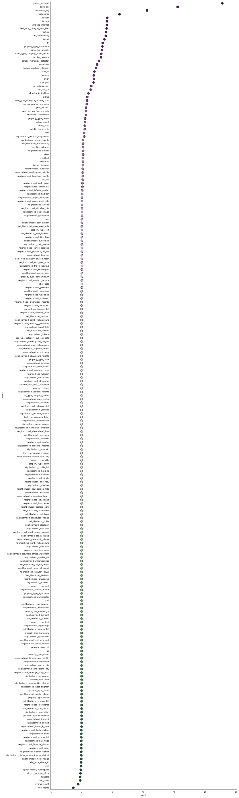


```python
tents = query("SELECT lid, price FROM listings where property_type='Tent'")
tents
```


<div>
<table border="1" class="dataframe">
  <thead>
    <tr style="text-align: right;">
      <th></th>
      <th>lid</th>
      <th>price</th>
    </tr>
  </thead>
  <tbody>
    <tr>
      <th>0</th>
      <td>8522062</td>
      <td>33</td>
    </tr>
    <tr>
      <th>1</th>
      <td>8522326</td>
      <td>39</td>
    </tr>
    <tr>
      <th>2</th>
      <td>8928490</td>
      <td>333</td>
    </tr>
    <tr>
      <th>3</th>
      <td>8539002</td>
      <td>36</td>
    </tr>
    <tr>
      <th>4</th>
      <td>6315054</td>
      <td>1099</td>
    </tr>
    <tr>
      <th>5</th>
      <td>4178830</td>
      <td>100</td>
    </tr>
    <tr>
      <th>6</th>
      <td>8574451</td>
      <td>33</td>
    </tr>
    <tr>
      <th>7</th>
      <td>3728552</td>
      <td>250</td>
    </tr>
    <tr>
      <th>8</th>
      <td>4909388</td>
      <td>65</td>
    </tr>
    <tr>
      <th>9</th>
      <td>8582786</td>
      <td>39</td>
    </tr>
    <tr>
      <th>10</th>
      <td>8455367</td>
      <td>38</td>
    </tr>
    <tr>
      <th>11</th>
      <td>8582911</td>
      <td>88</td>
    </tr>
    <tr>
      <th>12</th>
      <td>8645816</td>
      <td>46</td>
    </tr>
  </tbody>
</table>
</div>


```python
from selenium import webdriver
lid = tents.loc[4, 'lid']
url = 'https://www.airbnb.com/rooms/{0}'.format(lid)
driver = webdriver.Chrome(executable_path='/opt/chromedriver')
driver.get(url)
```


```python
lid = tents.loc[2, 'lid']
url = 'https://www.airbnb.com/rooms/{0}'.format(lid)
driver.get(url)
```


```python
lid = tents.loc[7, 'lid']
url = 'https://www.airbnb.com/rooms/{0}'.format(lid)
driver.get(url)
```


```python
coefs_hood = coefs[coefs.feature_type == 'neighborhood']
g = sns.PairGrid(coefs_hood,
                 x_vars=['coef'], y_vars=["feature"],
                 size=50, aspect=.25)

# Draw a dot plot using the stripplot function
g.map(sns.stripplot, size=10, orient="h",
      palette="PRGn", edgecolor="gray")
```


    <seaborn.axisgrid.PairGrid at 0x11a745c90>


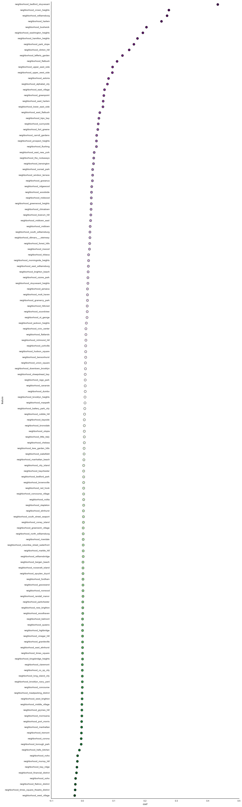


```python
coefs_other = coefs[coefs.feature_type == 'other']
g = sns.PairGrid(coefs_other,
                 x_vars=['coef'], y_vars=["feature"],
                 size=15, aspect=.25)

# Draw a dot plot using the stripplot function
g.map(sns.stripplot, size=10, orient="h",
      palette="PRGn", edgecolor="gray")
```


    <seaborn.axisgrid.PairGrid at 0x11f7b7d50>


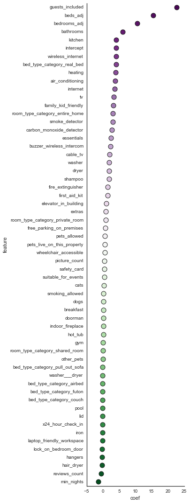


## Module 14: Scoring a test set

### working around some issues with null values being in the test set


```python
df = query('SELECT * FROM dev.x00101_test_set LIMIT 1')
subq = 'SELECT '
subq += '\n'.join([', COALESCE({0},0) AS {0}'.format(c) for c in df.columns])[2:]
subq += '\n FROM dev.x00101_test_set'
```

### Prices and residuals using madlib.linregr_predict


```python
q = """
SELECT test.lid, test.price,
       madlib.linregr_predict({1}, m.coef
       ) as prediction,
       price - madlib.linregr_predict({1}, m.coef
       ) as residual
FROM ({0}) test, dev.x01000_linreg m
""".format(subq, features)
df = query(q)
```

### Simple Root Mean Squared Error (RMSE)

* #### in Python (using the previous query)


```python
df.head()
```


<div>
<table border="1" class="dataframe">
  <thead>
    <tr style="text-align: right;">
      <th></th>
      <th>lid</th>
      <th>price</th>
      <th>prediction</th>
      <th>residual</th>
    </tr>
  </thead>
  <tbody>
    <tr>
      <th>0</th>
      <td>7733315</td>
      <td>119</td>
      <td>135.741241</td>
      <td>-16.741241</td>
    </tr>
    <tr>
      <th>1</th>
      <td>4325480</td>
      <td>85</td>
      <td>126.576669</td>
      <td>-41.576669</td>
    </tr>
    <tr>
      <th>2</th>
      <td>105</td>
      <td>899</td>
      <td>132.440018</td>
      <td>766.559982</td>
    </tr>
    <tr>
      <th>3</th>
      <td>4063357</td>
      <td>125</td>
      <td>160.598386</td>
      <td>-35.598386</td>
    </tr>
    <tr>
      <th>4</th>
      <td>9699493</td>
      <td>500</td>
      <td>119.531284</td>
      <td>380.468716</td>
    </tr>
  </tbody>
</table>
</div>


```python
math.sqrt((df.residual**2).mean())
```


    179.1908983804969


* #### in SQL


```python
q = """
SELECT sqrt(avg((price - madlib.linregr_predict({1}, m.coef
       ))^2)) as RMSE
FROM ({0}) test, dev.x01000_linreg m
""".format(subq, features)
query(q).head()
```


<div>
<table border="1" class="dataframe">
  <thead>
    <tr style="text-align: right;">
      <th></th>
      <th>rmse</th>
    </tr>
  </thead>
  <tbody>
    <tr>
      <th>0</th>
      <td>179.190898</td>
    </tr>
  </tbody>
</table>
</div>


## Module 15: tuning parameters

```sql
elastic_net_train( tbl_source,
                   tbl_result,
                   col_dep_var,
                   col_ind_var,
                   regress_family,
                   alpha,
                   lambda_value,
                   standardize,
                   grouping_col,
                   optimizer,
                   optimizer_params,
                   excluded,
                   max_iter,
                   tolerance
                 )
```


```python
df = query('SELECT * FROM dev.x00100_train_set LIMIT 1')
q = 'CREATE TABLE dev.x00104_train_set_nonnull AS SELECT '
q += '\n'.join([', COALESCE({0},0) AS {0}'.format(c) for c in df.columns])[2:]
q += '\n FROM dev.x00100_train_set DISTRIBUTED RANDOMLY'
query(q)
```


    psycopg2.ProgrammingError('no results to fetch')


### Elastic Net requires the data to be standardized
* #### MADlib has the option built-in, but we can implement it explicitly, either with pure SQL or PL/Python

### Reminder on PL/Python Syntax
```sql
CREATE OR REPLACE FUNCTION <name>(<parameter> <datatype>)
    RETURNS <return type>
AS
$$  
	<python code>
$$ 
LANGUAGE PLPYTHONU;```


```python
query(["""
DROP FUNCTION dev.standardize(float[])
""",
"""
CREATE OR REPLACE FUNCTION dev.standardize(vec float[])
    RETURNS float[]
AS
$$  
    import numpy as np
    v = np.array(vec)
    u = v.mean()
    s = v.std()
    return (v - u)/(2 * s)
$$
LANGUAGE PLPYTHONU
"""], False)
```

### Steps to standardize a column:
* #### cast as float (so we can use one generic function)
* #### put the column into an array_agg (essentially a column vector)
* #### what's the downside of this approach?


```python
query("""
SELECT dev.standardize(array_agg(air_conditioning::float))
FROM dev.x00104_train_set_nonnull
""")
```


<div>
<table border="1" class="dataframe">
  <thead>
    <tr style="text-align: right;">
      <th></th>
      <th>standardize</th>
    </tr>
  </thead>
  <tbody>
    <tr>
      <th>0</th>
      <td>[0.22435024087, 0.22435024087, 0.22435024087, ...</td>
    </tr>
  </tbody>
</table>
</div>


```python
query("""
SELECT dev.standardize(array_agg(air_conditioning::float)) AS air_conditioning
  , dev.standardize(array_agg(bathrooms::float)) AS bathrooms
FROM dev.x00104_train_set_nonnull
""")
```


<div>
<table border="1" class="dataframe">
  <thead>
    <tr style="text-align: right;">
      <th></th>
      <th>air_conditioning</th>
      <th>bathrooms</th>
    </tr>
  </thead>
  <tbody>
    <tr>
      <th>0</th>
      <td>[0.22435024087, 0.22435024087, 0.22435024087, ...</td>
      <td>[-0.144214481501, -0.144214481501, -0.14421448...</td>
    </tr>
  </tbody>
</table>
</div>


```python
query("""
SELECT UNNEST(air_conditioning) as air_conditioning
    , UNNEST(bathrooms) as bathrooms FROM
(SELECT dev.standardize(array_agg(air_conditioning::float)) AS air_conditioning
  , dev.standardize(array_agg(bathrooms::float)) AS bathrooms
FROM dev.x00104_train_set_nonnull) q
""").head(20)
```


<div>
<table border="1" class="dataframe">
  <thead>
    <tr style="text-align: right;">
      <th></th>
      <th>unnest</th>
      <th>unnest</th>
    </tr>
  </thead>
  <tbody>
    <tr>
      <th>0</th>
      <td>0.224350</td>
      <td>-0.144214</td>
    </tr>
    <tr>
      <th>1</th>
      <td>0.224350</td>
      <td>-0.144214</td>
    </tr>
    <tr>
      <th>2</th>
      <td>0.224350</td>
      <td>-0.144214</td>
    </tr>
    <tr>
      <th>3</th>
      <td>0.224350</td>
      <td>-0.144214</td>
    </tr>
    <tr>
      <th>4</th>
      <td>0.224350</td>
      <td>-0.144214</td>
    </tr>
    <tr>
      <th>5</th>
      <td>0.224350</td>
      <td>-0.144214</td>
    </tr>
    <tr>
      <th>6</th>
      <td>0.224350</td>
      <td>-0.144214</td>
    </tr>
    <tr>
      <th>7</th>
      <td>0.224350</td>
      <td>-0.144214</td>
    </tr>
    <tr>
      <th>8</th>
      <td>0.224350</td>
      <td>-0.144214</td>
    </tr>
    <tr>
      <th>9</th>
      <td>0.224350</td>
      <td>-0.144214</td>
    </tr>
    <tr>
      <th>10</th>
      <td>-1.114329</td>
      <td>-0.144214</td>
    </tr>
    <tr>
      <th>11</th>
      <td>0.224350</td>
      <td>-0.144214</td>
    </tr>
    <tr>
      <th>12</th>
      <td>-1.114329</td>
      <td>1.160787</td>
    </tr>
    <tr>
      <th>13</th>
      <td>0.224350</td>
      <td>-0.144214</td>
    </tr>
    <tr>
      <th>14</th>
      <td>0.224350</td>
      <td>-0.144214</td>
    </tr>
    <tr>
      <th>15</th>
      <td>0.224350</td>
      <td>-0.144214</td>
    </tr>
    <tr>
      <th>16</th>
      <td>0.224350</td>
      <td>-0.144214</td>
    </tr>
    <tr>
      <th>17</th>
      <td>-1.114329</td>
      <td>-0.144214</td>
    </tr>
    <tr>
      <th>18</th>
      <td>0.224350</td>
      <td>-0.144214</td>
    </tr>
    <tr>
      <th>19</th>
      <td>0.224350</td>
      <td>-0.144214</td>
    </tr>
  </tbody>
</table>
</div>


#### Iterate over all the columns to standardize each


```python
all_cols = [c for c in query('SELECT * FROM dev.x00104_train_set_nonnull LIMIT 1').columns \
               if c != 'lid']
```


```python
%%time
q = 'CREATE TABLE dev.x00105_train_set_stdized \n'
q += 'AS SELECT ' 
q += '\n'.join([', UNNEST({0}) AS {0}'.format(c) for c in all_cols])[2:]
q += '\n FROM (SELECT \n' 
q += '\n'.join([', dev.standardize(array_agg({0}::float)) AS {0}'.format(c) for c in all_cols])[2:]
q += '\n FROM dev.x00104_train_set_nonnull) q'
query(['DROP TABLE IF EXISTS dev.x00105_train_set_stdized CASCADE', q])
```

    CPU times: user 14.3 ms, sys: 10.1 ms, total: 24.5 ms
    Wall time: 9min 18s


```python
df = query('SELECT * FROM dev.x00105_train_set_stdized LIMIT 1')
cols = str(sorted([c for c in df.columns if c not in ['lid', 'price']]))
features = 'ARRAY[1, ' + cols.replace("'",'')[1:]

for alpha in [0, 0.5, 1.0]:
    for l in [3, 2, 1, 0, -1, -2]:
        q = ["""
        DROP TABLE IF EXISTS dev.x01001_linreg_regularized_{0}__{1}
        """.format(str(alpha).replace('.','_'), str(10**l).replace('.','_')), 
        """
        SELECT madlib.elastic_net_train( 'dev.x00105_train_set_stdized',
                 'dev.x01001_linreg_regularized_{3}__{4}',
                 'price',
                 '{0}',
                 'gaussian',
                 {1},
                 {2},
                 FALSE,
                 NULL,
                 'fista',
                 '',
                 NULL,
                 10000,
                 1e-6
               )
        """.format(features, alpha, 10**l, str(alpha).replace('.','_'), str(10**l).replace('.','_'))]
        %time query(q)
        sys.stderr.write(str(alpha) + ',' + str(l) + '\n')
```

    CPU times: user 190 ms, sys: 137 ms, total: 327 ms
    Wall time: 2h 28min 36s
    CPU times: user 4.39 ms, sys: 2.52 ms, total: 6.92 ms

    0,3
    0,2


    
    Wall time: 2min 11s
    CPU times: user 2.82 ms, sys: 1.45 ms, total: 4.27 ms
    Wall time: 1min 5s
    CPU times: user 1.95 ms, sys: 806 µs, total: 2.76 ms

    0,1
    0,0


    
    Wall time: 36.9 s
    CPU times: user 1.79 ms, sys: 816 µs, total: 2.6 ms
    Wall time: 33.2 s
    CPU times: user 2.01 ms, sys: 782 µs, total: 2.79 ms

    0,-1
    0,-2


    
    Wall time: 32.5 s
    CPU times: user 925 µs, sys: 273 µs, total: 1.2 ms
    Wall time: 5.95 s
    CPU times: user 1.19 ms, sys: 486 µs, total: 1.68 ms

    0.5,3
    0.5,2


    
    Wall time: 5.5 s
    CPU times: user 1.19 ms, sys: 310 µs, total: 1.5 ms
    Wall time: 5.5 s
    CPU times: user 1.09 ms, sys: 453 µs, total: 1.54 ms

    0.5,1
    0.5,0


    
    Wall time: 6.23 s
    CPU times: user 1.53 ms, sys: 548 µs, total: 2.07 ms
    Wall time: 20.9 s
    CPU times: user 1.98 ms, sys: 797 µs, total: 2.78 ms

    0.5,-1
    0.5,-2


    
    Wall time: 36 s
    CPU times: user 1.17 ms, sys: 329 µs, total: 1.49 ms
    Wall time: 5.48 s
    CPU times: user 1.17 ms, sys: 351 µs, total: 1.52 ms

    1.0,3
    1.0,2


    
    Wall time: 5.12 s
    CPU times: user 1.17 ms, sys: 311 µs, total: 1.49 ms
    Wall time: 5.78 s
    CPU times: user 1.13 ms, sys: 289 µs, total: 1.42 ms

    1.0,1
    1.0,0


    
    Wall time: 5.34 s
    CPU times: user 1.24 ms, sys: 316 µs, total: 1.55 ms
    Wall time: 7.66 s
    CPU times: user 2.23 ms, sys: 928 µs, total: 3.16 ms

    1.0,-1
    1.0,-2


    
    Wall time: 44.5 s


```python
elastic_net_results = {}
for alpha in [0, 0.5, 1.0]:
    elastic_net_results[alpha] = {}
    for l in [3, 2, 1, 0, -1, -2]:
        q = ["""
        SELECT * FROM dev.x01001_linreg_regularized_{0}__{1}
        """.format(str(alpha).replace('.','_'), str(10**l).replace('.','_'))]
        elastic_net_results[alpha][l] = query(q)
```


```python
for alpha in [0, 0.5, 1.0]:
    for l in [3, 2, 1, 0, -1, -2]:
        print 'alpha={0}, lambda={1}, nonzero_coef={2}'.format(alpha, l, \
                    len(list(elastic_net_results[alpha][l].coef_nonzero)[0]))
```

    alpha=0, lambda=3, nonzero_coef=217
    alpha=0, lambda=2, nonzero_coef=217
    alpha=0, lambda=1, nonzero_coef=217
    alpha=0, lambda=0, nonzero_coef=217
    alpha=0, lambda=-1, nonzero_coef=217
    alpha=0, lambda=-2, nonzero_coef=217
    alpha=0.5, lambda=3, nonzero_coef=0
    alpha=0.5, lambda=2, nonzero_coef=0
    alpha=0.5, lambda=1, nonzero_coef=0
    alpha=0.5, lambda=0, nonzero_coef=0
    alpha=0.5, lambda=-1, nonzero_coef=5
    alpha=0.5, lambda=-2, nonzero_coef=61
    alpha=1.0, lambda=3, nonzero_coef=0
    alpha=1.0, lambda=2, nonzero_coef=0
    alpha=1.0, lambda=1, nonzero_coef=0
    alpha=1.0, lambda=0, nonzero_coef=0
    alpha=1.0, lambda=-1, nonzero_coef=0
    alpha=1.0, lambda=-2, nonzero_coef=27


```python
elastic_net_results[1][-2]
```


<div>
<table border="1" class="dataframe">
  <thead>
    <tr style="text-align: right;">
      <th></th>
      <th>family</th>
      <th>features</th>
      <th>features_selected</th>
      <th>coef_nonzero</th>
      <th>coef_all</th>
      <th>intercept</th>
      <th>log_likelihood</th>
      <th>standardize</th>
      <th>iteration_run</th>
    </tr>
  </thead>
  <tbody>
    <tr>
      <th>0</th>
      <td>gaussian</td>
      <td>[1, air_conditioning, bathrooms, bed_type_cate...</td>
      <td>[bathrooms, bedrooms_adj, beds_adj, cable_tv, ...</td>
      <td>[0.169754072827, 0.078126027211, 0.00572285101...</td>
      <td>[0.0, 0.0, 0.169754072827, 0.0, 0.0, 0.0, 0.0,...</td>
      <td>-5.435839e-14</td>
      <td>-0.101042</td>
      <td>False</td>
      <td>46</td>
    </tr>
  </tbody>
</table>
</div>


## Module 16: What we didn't get to cover that I originally hoped to

### i.e. some things you can try

* ### Pooling vs. no pooling vs. partial pooling

* ### Text analytics 
 * #### NLTK with PL/Python
 * #### LDA and other algorithms in MADlib

* ### Cluster neighborhoods

* ### Training Models in PL/Python 
 * #### how to work with arrays, array_aggregates, custom_aggregates for passing matrices
 * #### scikit-learn for training models, grid search, sampling
 * #### popular models that we can use to extend scikit-learn, e.g. gradient boosted trees
 * #### parallelism with PL/Python

* ### dask and blaze

* ### todo: compare time for external table to internal table
* ### PL/Python function to standardize (repeatable)
* ### pgSQL function to repeat CV split (maybe return the right number of folds ... standardize table names to do k-fold CV)
* ### also try out MADlib's CV function


```python

```
